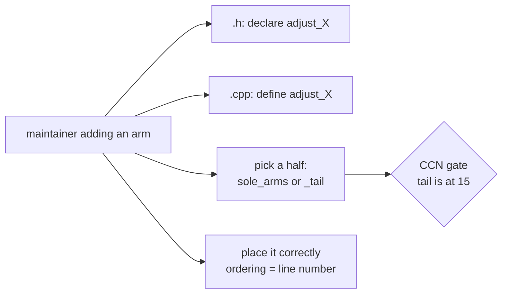
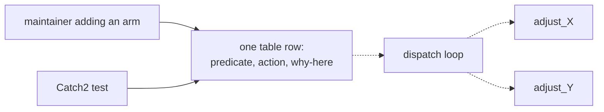
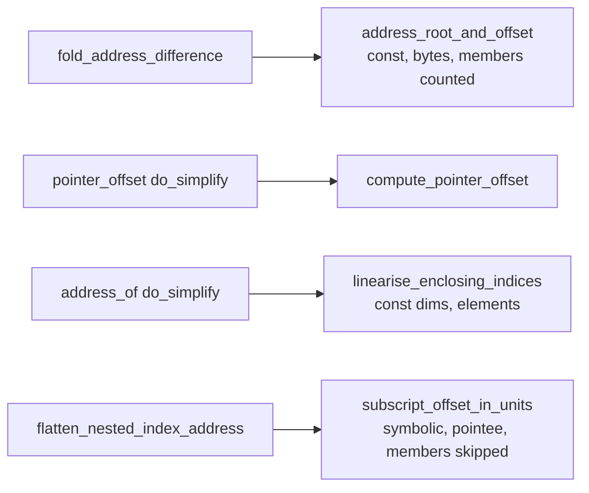
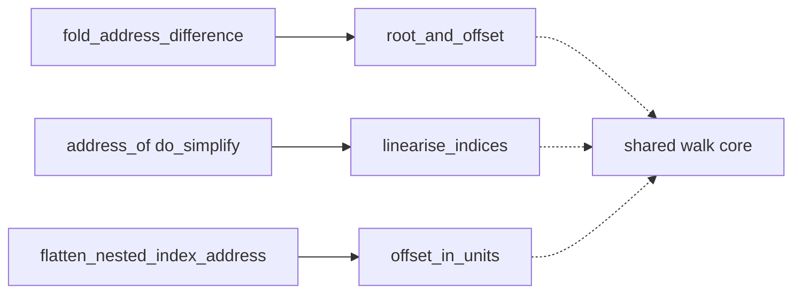
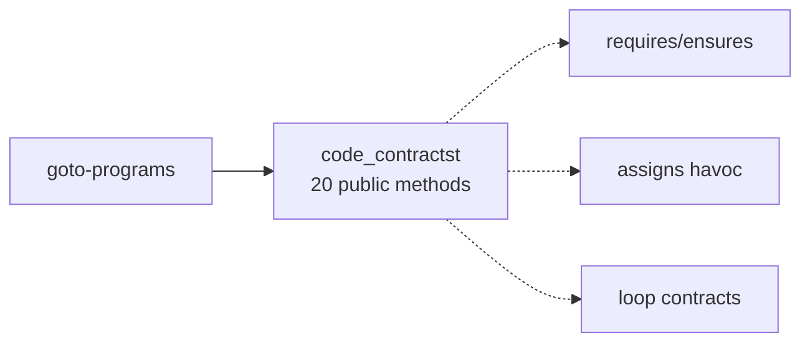
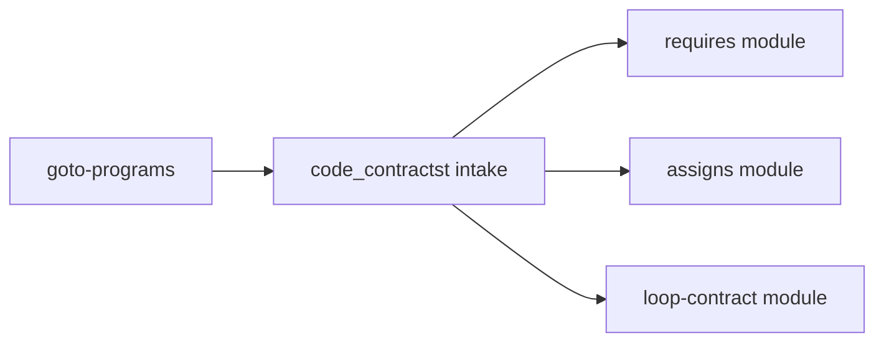
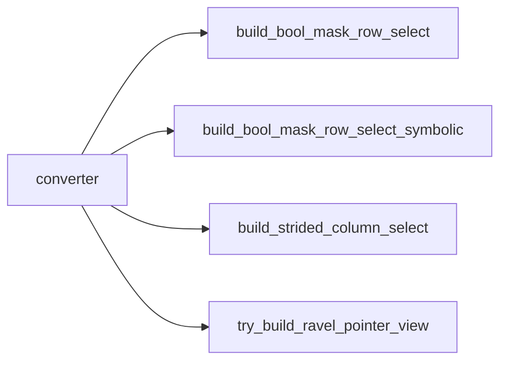
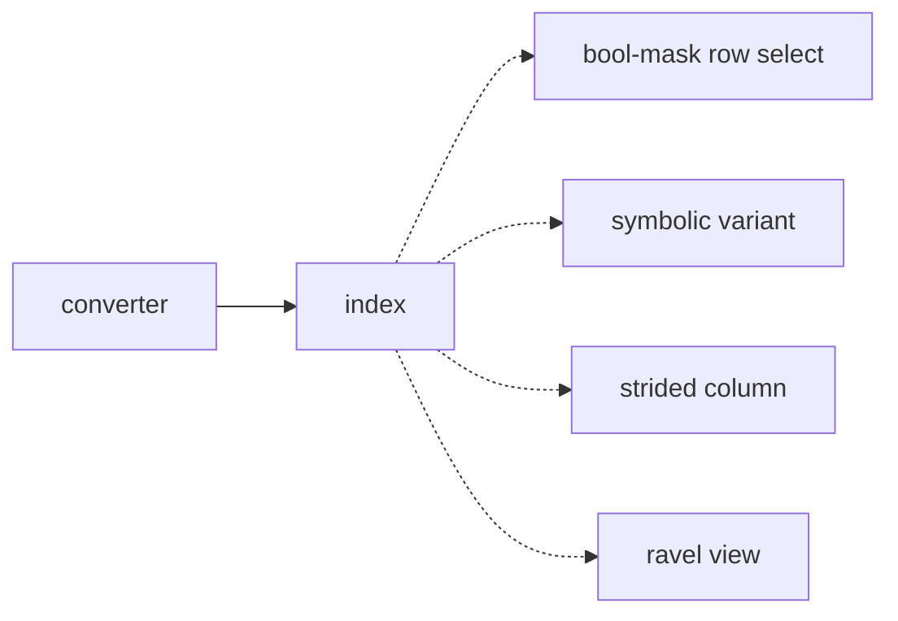
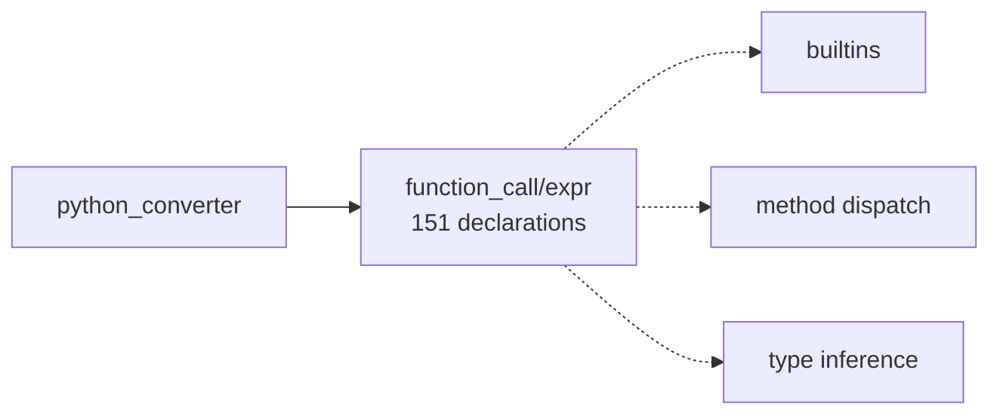
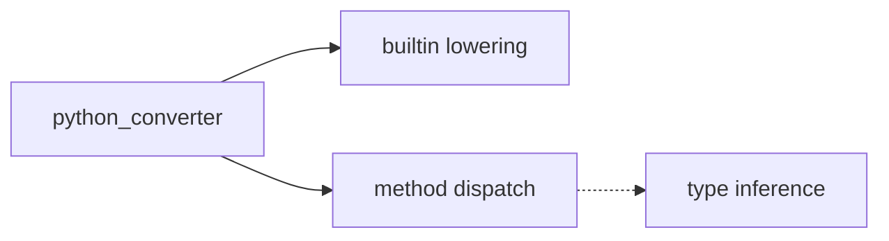

# Architecture review — esbmc — 2026-08-31

**Scope**: The repository's change hot spots, inferred from the last 300 commits
(`git log --format='' --name-only -300 | sort | uniq -c | sort -rn`) rather than
from a whole-tree sweep. Deepening pays back through *future* change, so cold
code is out of scope no matter how shallow it looks. The top code hot spots were
`src/clang-c-frontend/clang_c_adjust_irep2.{cpp,h}` (29 + 19 = 48 touches),
`src/python-frontend/` (converter, python-list, function_call, dynamic_type) and
`src/cpp/library/` (92 touches, but operational-model data — see *Dropped*).

**Picked**: `irep2-adjust-arm-table` — see `.architecture/backlog.md`

**Degradations**: none. `gh` authenticated; sub-agent exploration available; the
project's quality gate (cmake/ninja + ctest) configured and green at baseline
(720/720 unit tests, 91/91 `regression/esbmc/irep2_only_*`).

**Method note**: candidates came from two independent passes — a direct hot-spot
analysis and a sub-agent sweep — which were then reconciled. The sweep surfaced
four candidates the direct pass missed, including the one that came closest to
taking the pick. Both passes independently identified `irep2-adjust-arm-table`.
Twelve candidates are recorded in `.architecture/backlog.md`; the four cards
below plus the runner-up are the ones that materially affected the decision.

**Diagram convention**: in every before/after pair, solid edges are the
**interface** — what a caller or a maintainer adding behaviour must know — and
dashed edges are inside the **implementation**.

---

## Candidates

### `irep2-adjust-arm-table` — the IREP2 adjust pass's arm chain is control flow, not data · Strong · score 23/25

**Files**

- `src/clang-c-frontend/clang_c_adjust_irep2.h:56-181` — the private arm declarations
- `src/clang-c-frontend/clang_c_adjust_irep2.cpp:217-254` — `adjust_sole_arms`
- `src/clang-c-frontend/clang_c_adjust_irep2.cpp:259-302` — `adjust_sole_arms_tail`
- File-count estimate the blast-radius band was derived from: **4** (the two
  sources, plus a new Catch2 test and its one-line `CMakeLists.txt` entry)

**Score** 23/25

| Axis | Score | Justification |
|---|---|---|
| Leverage | 4 | 8 of the last 12 commits to this file added an arm, and each needed three coordinated edits — a header declaration, a `.cpp` definition, and an insertion at the correct position in one of two chain functions. A table collapses the first and third into one row. Not 5: the gain accrues to maintainers adding arms, not to callers outside the module. |
| Locality | 5 | An arm's predicate, its action, its position in the order and the *reason* for that position currently live in four different places. In a table they are one row, and the ordering rationale sits beside the constraint it explains. |
| Blast radius | 1 | Two source files; no published interface changes. The class's external interface is `adjust()` and `adjust_expr()`, constructed once at `src/clang-c-frontend/clang_c_language.cpp:483` — both unchanged. |
| Heat | 5 | 48 touches across the `.cpp`/`.h` pair in the last 300 commits, the hottest code pair in the repository; 16 of the last 25 commits edited both files together. Most recent change 2026-08-31. |

**Problem**

`clang_c_adjust_irep2` is externally **deep** — one constructor and `adjust()`
hide a whole-program IREP2 walk. The friction is at its **internal seam**. The
pass's ~20 rewrite arms are dispatched by a hand-ordered chain of
`if (is_X(expr)) adjust_X(expr);` statements, and the order is load-bearing:
`adjust_function_designators` must run before `adjust_call_callee` "since that is
what it reads" (`clang_c_adjust_irep2.cpp:219-220`), and
`adjust_statement_condition` must run before `hoist_for_init` because the hoist
"rewrites a `code_for2t` into a block, and a block is not a
statement-with-condition" (`clang_c_adjust_irep2.cpp:241-243`). Those constraints
exist only as prose next to a statement position. Nothing checks them, and
`grep clang_c_adjust_irep2 unit/` returns nothing — the pass has no unit-level
test surface at all.

The chain has also outgrown its container. `adjust_sole_arms_tail` exists purely
because of a lint threshold — its own comment says it is "split only to keep
either half under the complexity gate". Measured with the repository's own tool
(`lizard==1.23.0`, modified CCN, as `scripts/complexity/ccn_report.py` uses):

```
25 NLOC  CCN 11  clang_c_adjust_irep2::adjust_sole_arms@217-254
34 NLOC  CCN 15  clang_c_adjust_irep2::adjust_sole_arms_tail@259-302
```

The `core` partition threshold is 15 and rule R1 fires when a function's CCN
"increases and ends above it". `adjust_sole_arms_tail` is at exactly 15, so the
**next arm added to it trips the gate** and forces a third arbitrarily-named
split. The module's shape is being dictated by a lint threshold rather than by
design, and that is a recurring cost on the repository's hottest file.

**Deletion test**

Delete `adjust_sole_arms`/`adjust_sole_arms_tail` and inline both into
`adjust_expr`: complexity **concentrates** into one function at CCN ~28, well
over the gate, which is why the split exists. That is the signal — the arm set is
real behaviour that wants a home, not a pass-through. It is asking to absorb
more (its own ordering, its own enumerability), not to be flattened.

**Solution**

Replace the two chain functions with one ordered, `constexpr`-friendly table of
arm records — `{name, predicate, action, why-here}` — walked by a single loop.
Each arm becomes one row: its predicate is a function pointer, its action a
pointer-to-member, its ordering rationale a string beside them. Where the chain
currently relies on `else if` for exclusion (`is_complex_unary` shadowing
`is_neg2t || is_bitnot2t`; `is_arith_or_bitwise` shadowing `is_shift`), the
exclusion becomes an explicit conjunct in the row's predicate rather than an
artefact of statement position.

**Benefits**

- **Leverage**: adding an arm becomes one table row instead of a header
  declaration plus a positioned insertion into whichever half is currently under
  the gate. The recurring three-edit dance that 8 of the last 12 commits paid
  disappears.
- **Locality**: an arm's ordering constraint stops being implied by its line
  number. It sits in the row, next to the predicate it constrains.
- **Test surface**: the arm set becomes *enumerable*. A Catch2 test can walk the
  table and assert the documented ordering constraints hold — that
  `adjust_function_designators` precedes `adjust_call_callee`, that
  `adjust_statement_condition` precedes `hoist_for_init` — which is impossible
  today because the order is control flow, not data. This is the point: the
  interface becomes the test surface. It also removes the gate pressure, since
  the dispatch loop's CCN is constant in the number of arms.

**Before**



**After**



---

### `address-decomposition-single-walk` — five walks, four disagreeing contracts · Worth exploring · score 20/25

**Files**

- `src/util/expr/expr_simplifier.cpp:740` — `address_root_and_offset`
- `src/util/expr/expr_simplifier.cpp:779` — `fold_address_difference`
- `src/util/expr/expr_simplifier.cpp:3589` — `linearise_enclosing_indices`
- `src/util/expr/expr_simplifier.cpp:3771` — `subscript_offset_in_units`
- `src/util/expr/expr_simplifier.cpp:3932` — `cancel_shared_pointer_base`
- `src/util/expr/type_byte_size.cpp` — `pointer_offset_bits`, `compute_pointer_offset`
- File-count estimate: **4**

**Score** 20/25

| Axis | Score | Justification |
|---|---|---|
| Leverage | 3 | Revised down from 5 — see *Problem*. There is a genuinely shared core (typecast peeling, the walk skeleton, `member_offset`), but the five contracts differ deliberately along four orthogonal axes, so a single entry point reconciling them needs a knob per axis. Callers would trade five named walks for one function plus four knobs they must still choose correctly. |
| Locality | 5 | The decision "what counts as a base, in what unit, and does the member path stay in the base" is genuinely made five times. |
| Blast radius | 2 | Three or four files if the module gets its own header. Deliberately *not* placed in `type_byte_size.h`, which 29 files across `goto-symex`, `pointer-analysis`, `solvers`, `clang-c-frontend` and `goto2c` include — putting it there would make this a 4. |
| Heat | 5 | 9 touches in the last 300 commits, and six of them are one cluster landed inside ten days: #7346, #7391, #7392, #7393, #7394, #7395. Most recent 2026-08-31. |

**Problem**

This is the best-evidenced *friction* in the repository. Six pull requests in ten
days each hand-rolled part of the same operation — turn an address into a base
object plus an offset — and none of them could reuse the others, because each
existing walk answers a different question:

| Walk | Subscripts | Units | Members | Base returned |
|---|---|---|---|---|
| `address_root_and_offset:740` | constant only | bytes | counted via `member_offset` | unzeroed root |
| `linearise_enclosing_indices:3589` | constant, *and* constant array dims | linear elements | not handled | rebuilt, zeroed |
| `subscript_offset_in_units:3771` | symbolic permitted | the pointer's own pointee | deliberately skipped | caller rebuilds |

Each presents a raw `expr2tc` in and out, so no caller can tell from the
**interface** which rules it just got.

**Deletion test**

Concentrates — the walk skeleton is real shared behaviour. But *the proposed
deepening does not follow from that*, which is why this card is `Worth
exploring` rather than `Strong`.

**Solution — and why it was not taken**

The obvious move is one `decompose_address(expr, unit_choice)` returning a
base/offset struct. Reading the code, the differences are load-bearing, not
accidental: `subscript_offset_in_units` skips members *precisely because* its
caller rebuilds a base that keeps the member path (its comment notes counting
them twice would surface once a struct has padding before the member), while
`address_root_and_offset` counts them *precisely because* it returns an unzeroed
root. Those two cannot share one contract without a knob meaning "did you
rebuild the base?", plus knobs for units and for constant-vs-symbolic. That is a
**union**, not a deepening: the resulting interface is nearly as complex as the
implementations it replaces, and every caller still has to choose correctly — so
**leverage** per unit of interface goes *down*, not up.

The right change is narrower: extract only the genuinely common core and leave
the four contracts as named, documented entry points over it. Scoping that is a
judgement call about which differences are essential, and it lands in
soundness-critical code where a wrong unification yields unsound verdicts that
the regression suite would not catch — the repository maintains a dedicated
SMT-backed simplifier equivalence checker (`ENABLE_SIMPLIFIER_EQUIVALENCE_CHECK`,
and #7351 "fix the simplifier equivalence job and the bugs it found") for exactly
this reason. That is a decision for a human, and it would warrant
`needs-svcomp-run`.

One claim from the sweep did not survive checking: that the `array_size_excp`
catch is present in two places and missing in a third.
`linearise_enclosing_indices` never calls `type_byte_size` — it reads constant
`array_size` values directly — so it has no exception path to guard. There are
two catch sites, at lines 810 and 3803, and both are correct.

**Benefits** (of the narrower change) **Locality** for the walk skeleton;
**leverage** only if the entry points stay named.

**Before**



**After** (the narrower change, not the union)



---

### `contracts-single-file-seam` — `code_contractst` has no internal seam · Worth exploring · score 15/25

**Files**

- `src/goto-programs/contracts/contracts.h:61-866` — one class, 20 public + 55 private methods
- `src/goto-programs/contracts/contracts.cpp` — 6125 lines
- File-count estimate: **9**

**Score** 15/25 — leverage 3, locality 3, blast radius 3, heat 3.

| Axis | Score | Justification |
|---|---|---|
| Leverage | 3 | Splitting requires/ensures, assigns-clause and loop-contract handling behind their own seams would simplify each call site materially, but the callers are few. |
| Locality | 3 | A change to assigns-clause handling today lands in the same file as everything else, but usually in one contiguous region — the pain is navigational rather than multi-site. |
| Blast radius | 3 | One class used across `goto-programs`; a signature split reaches several modules. 9–20 files. |
| Heat | 3 | 6 touches in the last 300 commits, most recent 2026-09-01. Warm, not hot. |

**Problem** The **module** presents 20 public methods over a single 6125-line
implementation. Understanding one concept — how an `assigns` clause becomes a
havoc — means bouncing through a file that also holds `requires` instrumentation
and loop-invariant handling. There is no **seam** between the contract kinds.

**Deletion test** Concentrates: the contract instrumentation is genuine
behaviour. This is a candidate for *sub*-division, not deletion.

**Solution** Give each contract kind its own module behind a small interface,
with `code_contractst` retained as the intake.

**Benefits** **Locality** for each contract kind; each becomes independently
testable rather than reachable only through the whole pass.

**Before**



**After**



---

### `python-list-facade` — the interface names the strategy, not the operation · Worth exploring · score 15/25

**Files**

- `src/python-frontend/python-list/python_list.h` — 925 lines
- ten implementation files totalling ~9.5k lines, largest `list_access.cpp` at 4303
- File-count estimate: **11**

**Score** 15/25 — leverage 3, locality 3, blast radius 4, heat 4.

| Axis | Score | Justification |
|---|---|---|
| Leverage | 3 | Callers would gain a smaller vocabulary, but the call sites are concentrated in the converter rather than spread widely. |
| Locality | 3 | Adding a list operation already has a natural file; the cost is choosing among near-duplicate entry points. |
| Blast radius | 4 | Reaches the `python_converter` surface, which 37 files include. |
| Heat | 4 | 23 touches on the directory in the last 300 commits. |

**Problem** The **interface** is nearly as complex as what a caller needs:
`build_bool_mask_row_select`, `build_bool_mask_row_select_symbolic`,
`try_build_ravel_pointer_view`, `build_strided_column_select`,
`try_build_diagonal_pointer_view`. These name *how the lowering is built*, so a
caller must learn the implementation to choose one. That is the definition of a
**shallow** module: leverage per unit of interface learned is low.

**Deletion test** Moves, mostly — deleting `python_list` would push its bodies
back into the converter, which is where they came from. The deepening here is to
*shrink the interface*, not to relocate behaviour.

**Solution** Keep the ten implementation files as internal detail; present one
seam per list operation (index, slice, mutate, query) that selects the strategy
internally.

**Benefits** **Leverage** — the caller learns four verbs instead of fifty. **Test
surface** — strategy selection becomes testable through the operation rather
than by calling the strategy directly.

**Before**



**After**



---

### `function-call-expr-split` — 151 declarations over one implementation · Speculative · score 15/25

**Files**

- `src/python-frontend/function_call/expr.h` — 795 lines, 151 declarations
- `src/python-frontend/function_call/expr.cpp` — 7012 lines
- File-count estimate: **8**

**Score** 15/25 — leverage 3, locality 3, blast radius 4, heat 4.

| Axis | Score | Justification |
|---|---|---|
| Leverage | 3 | Real, but overlaps `python-list-facade` and `python-converter-god-class`; doing it alone leaves the same coupling in place. |
| Locality | 3 | Builtin lowering and method dispatch already tend to occupy distinct regions. |
| Blast radius | 4 | Touches the converter surface. |
| Heat | 4 | 16 touches on `function_call/` in the last 300 commits. |

**Problem** Builtin lowering, method dispatch and call-site type inference are
one **module** with no internal **seam**; the header is a list of 151 things a
maintainer must scan.

**Deletion test** Concentrates — but into the converter, which is already the
repository's largest class. Marked *Speculative* for that reason: it should be
sequenced after `python-converter-god-class`, not before it.

**Solution** Separate builtin lowering from method dispatch behind two seams.

**Benefits** **Locality** for builtin work, which is where most of the churn is.

**Before**



**After**



---

## Dropped

| Candidate | Dropped because |
|---|---|
| `cpp-om-library-headers` | Leverage 1 — fails the deletion test. `src/cpp/library/{string,vector,type_traits,map,…}` is the hottest directory in the repo (92 touches), but these are operational models that deliberately mirror libc++'s shape, including its `_LIBCPP_STD_VER` gating. Their interface is fixed by the C++ standard; making it "deeper" would make ESBMC diverge from the thing it models. The shape is a requirement, not a defect. |
| `python-converter-god-class` | Blast radius 5 — see *Too large to automate*. |
| `preprocessor-state-ownership` | Blast radius 5, and its deletion test comes out *moves* — see *Too large to automate*. |
| `list-element-types-owned-module` | Already in flight. PR #7366, "[python] Give per-instance element types one owned home", is open against this exact friction (`list_type_map` as a symbol-id-keyed process-global with ~59 raw access sites). Scored 19/25 and would otherwise rank second; dropped to avoid a competing PR, not on merit. Reconsider once #7366 lands. |

## Too large to automate

**`python-converter-god-class`** (leverage 5, locality 5, heat 5, blast radius 5
— 18/25 before the filter). `python_converter` declares 152 methods in a
1992-line header, implements them across thirteen files in
`src/python-frontend/converter/` (the largest, `converter_stmt.cpp`, is 303 KB),
and is included by 37 files. Every one of those thirteen translation units must
know the whole surface, so the **interface** is the entire class and **locality**
is nil: a change to statement conversion is compiled against by everything.

This is the highest-leverage deepening in the repository and it is real, but it
is a repo-wide migration for the Python frontend, not one unattended PR. A human
should schedule it — plausibly as a sequence, extracting one converter concern at
a time behind its own seam, with `function-call-expr-split` and
`python-list-facade` as later steps of the same programme. Note that PR #7366
("[python] Give per-instance element types one owned home") is already moving in
this direction.

**`preprocessor-state-ownership`** (blast radius 5). `Preprocessor` in
`src/python-frontend/preprocessor/` composes 19 mixins that all read and write
the same ~110 attributes declared in one flat `_init_preprocessor_state`, so
there is no **interface** between any two of them. Note its deletion test comes
out *moves*, not concentrates: collapsing the 19 mixins into one class makes
nothing worse, because nothing is hidden today. The file split is cosmetic
rather than a **seam**, and the real fix is state ownership — a programme, not a
PR. The sequence-iterator slice (3 files) is the automatable entry point if a
future run wants one.

## Pick

**`irep2-adjust-arm-table`**, at 23/25.

The runner-up **candidate** is `address-decomposition-single-walk` at 20/25.
**The top two were within 1 point on first scoring and the pick changed hands
once**, so the reasoning is recorded in full.

`address-decomposition-single-walk` initially scored 24/25 — leverage 5, on the
strength of six pull requests in ten days each hand-rolling the same address
walk, which is the single strongest recurring-friction signal in the repository.
On that number it would have been the pick, and the arm-table candidate would
have been the runner-up.

Reading the five walks changed the leverage score to 3. Their contracts differ
along four orthogonal axes — constant-only versus symbolic subscripts, byte
versus linear-element versus pointee units, member offsets counted versus
skipped, unzeroed root versus rebuilt zeroed base — and the differences are
deliberate and documented against issue numbers (#6778, #6779), not accidental
duplication. A single entry point reconciling them needs one knob per axis,
which is a union rather than a deepening: the interface ends up nearly as
complex as the implementation, and callers must still choose correctly. Leverage
per unit of interface would *fall*. That re-score, not a preference for the
incumbent, is what settled it.

Three things then separate the winner:

1. **The deepening is well-posed.** The arm table replaces positional control
   flow with ordered data and nothing else; there is no contract to reconcile
   and no semantic judgement call left open. The runner-up's correct scope is
   still an open question, which is a reason to hand it to a human rather than
   to an unattended run.
2. **Heat.** 48 touches across the `clang_c_adjust_irep2` pair in the last 300
   commits — the hottest code pair in the repository, and both passes found it
   independently.
3. **A dated forcing function.** `adjust_sole_arms_tail` sits at exactly the
   `core` CCN threshold of 15. The next arm added to it violates gate rule R1
   and forces a third arbitrary split. The other candidates degrade slowly; this
   one degrades on the next commit that touches it.

The honest cost of this pick, stated plainly: because the change is
behaviour-preserving by construction, the 91 existing regression tests cannot
distinguish before from after, so they are a safety net rather than a pin. The
new test pins the arm *ordering*, which is real and cannot be expressed today,
but it pins metadata rather than verification behaviour. The runner-up would
have offered a stronger behavioural pin — that is the trade accepted here, and a
reviewer is entitled to weigh it differently.

## Design

Written at step 4; see below.
