# Architecture review — esbmc — 2026-09-02

**Scope**: The recent-churn hot spots by `git log` — `src/python-frontend/` (converter, python-list, function_call, string, numpy, dict) and, secondarily, `src/clang-c-frontend/clang_c_adjust_irep2.*` and `src/util/expr/`. Deepening pays off through *future* change (YAGNI), so the scan was weighted toward files edited in the last ~90 days.
**Picked**: `constant-kind-dispatch-seam` — see the PR and `.architecture/backlog.md`.
**Degradations**: none. `gh` authenticated; sub-agents available.

*Diagram legend (used in every card): solid edges are the **interface** a caller must learn; dashed edges are inside the **implementation**.*

This is the first run: there was no `.architecture/backlog.md`, no `CONTEXT.md`, and no `docs/adr/`. No candidate contradicts an ADR (there are none), and none was already in the backlog.

## Candidates

### `constant-kind-dispatch-seam` — collapse four duplicated constant-kind ladders into one fold seam  ·  Strong  ·  score 22/25

- **Files** — `src/util/expr/expr_simplifier.cpp` (four ladders: `simplify_arith_2ops` `:264-330`, `simplify_arith_1op` `:1195-1241`, `simplify_logic_2ops` `:2087-2148`, `simplify_constant_relation` `:3683-3760`), plus the unit test `unit/util/simplify2t.test.cpp`. File-count estimate: **~2 files**.
- **Score** — **22/25**
  - *Leverage 4* — the three two-operand ladders each re-encode the same `kind → (is_constant predicate, get_value accessor, value type)` table; one seam removes that duplication across all three callers and centralises the per-kind mapping. Not a 5 because it pays back in-file rather than across many external call sites.
  - *Locality 4* — today, teaching the simplifier about a new constant kind (or fixing how one is accessed) means editing the same 4-arm ladder in three-to-four places; afterwards it is one edit in the seam plus its trait.
  - *Blast radius 1* — one implementation file, all four ladders + their `TFunctor` structs + ~15 call sites are `static`/file-local; **no published interface** (no exported header symbol, CLI flag, or wire format). Sanity-checked against the 1–3 file band.
  - *Heat 5* — `expr_simplifier.cpp` is the #2 file by churn; the last 8 commits are all `[simplifier]` fold-path work through 2026-08-31 (#7391–#7395, #7346, #7327), and #7269 edited `simplify_constant_relation` — one of the four ladders — directly.
- **Problem** — Each of the four functions contains the same hand-written block mapping an operand's runtime type to a constant accessor, verbatim:
  ```cpp
  if (is_bv_type(s1) || is_bv_type(s2)) {
    std::function<bool(const expr2tc &)> is_constant =
      (bool (*)(const expr2tc &)) & is_constant_int2t;
    std::function<BigInt &(expr2tc &)> get_value =
      [](expr2tc &c) -> BigInt & { return to_constant_int2t(c).value; };
    simpl_res = TFunctor<BigInt>::simplify(s1, s2, is_constant, get_value);
  }
  else if (is_fixedbv_type(...)) { /* same, fixedbvt / to_constant_fixedbv2t */ }
  else if (is_floatbv_type(...)) { /* same, ieee_floatt / to_constant_floatbv2t */ }
  else if (is_bool_type(...))    { /* same, bool / to_constant_bool2t */ }
  ```
  The **interface** a reader must learn to fold a binary op is "paste the 40-line ladder"; the **implementation** *is* that ladder — interface ≈ implementation, the definition of a shallow module. The duplication has already drifted: `simplify_constant_relation` instantiates `TFunctor<BigInt&>` (reference) where `simplify_arith_2ops`/`simplify_logic_2ops` instantiate `TFunctor<BigInt>` (value), and `simplify_arith_1op` uses a *third* contract — a single whole-constant `to_constant` accessor of arity one. Three functor contracts for one concept is the drift a single seam prevents from widening.
- **Deletion test** — **Concentrates.** Delete the ladder and the knowledge "a floatbv constant is a `constant_floatbv2t` whose value is an `ieee_floatt`" has nowhere to live; it must be pasted back into every caller — which is exactly today's state. A `constant_kind_traits` table pulls its weight.
- **Solution** — Introduce one templated seam, `dispatch_binary_fold<TFunctor, Wrap>(s1, s2)`, that owns the 4-arm `{bv, fixedbv, floatbv, bool}` dispatch and, per arm, sources the predicate/accessor from a per-kind trait and calls `TFunctor<Wrap<V>>::simplify(...)`. The `Wrap` template-alias knob (identity for value semantics, add-reference for `simplify_constant_relation`) preserves each functor's existing contract with **no functor rewritten**. Each caller keeps only what genuinely differs, caller-side: `simplify_arith_2ops` keeps its vector arm, its `assert(!floatbv)`, and its `from_integer` truncation fixup; `simplify_constant_relation` keeps its pointer/NULL arm. `simplify_arith_1op` (one operand, whole-constant accessor) is a distinct contract and is **scoped out** to keep the diff at its estimate.
- **Benefits** — *Leverage*: a caller/maintainer learns one fold entry point instead of a 4-arm ladder repeated across three functions. *Locality*: the per-kind predicate/accessor mapping lives in one trait; a new kind is one edit. *Test surface*: the seam is exercised through the real public interface `expr->simplify()`; the refactor's precondition is adding the currently-absent `fixedbv`/`floatbv` fold pins to `simplify2t.test.cpp` (143 cases today, **zero** fp/fixedbv coverage), which is a standalone testability win regardless of the refactor.
- **Before / After**

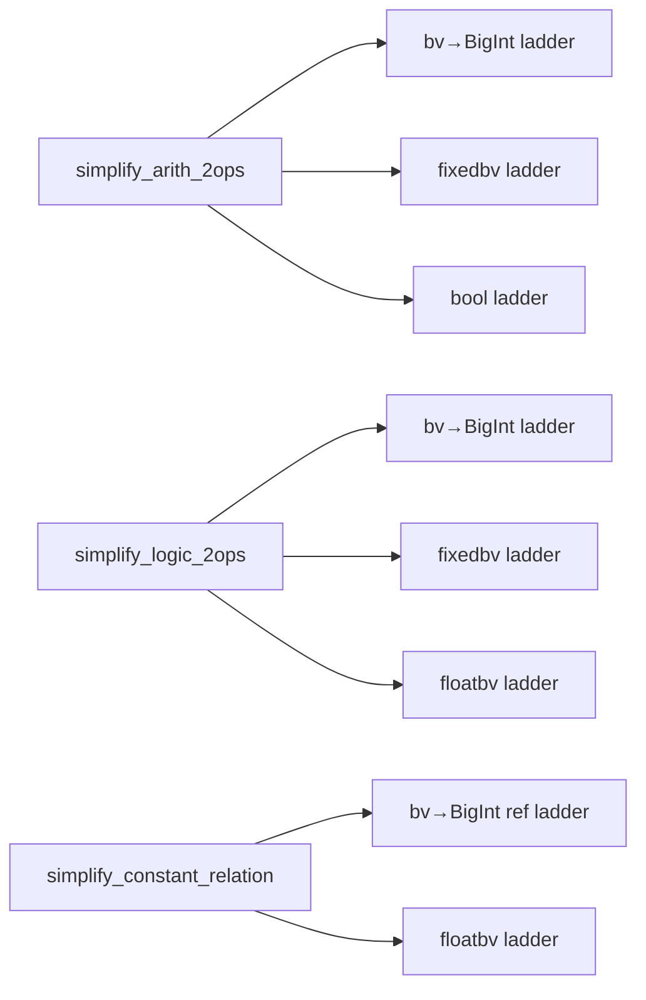

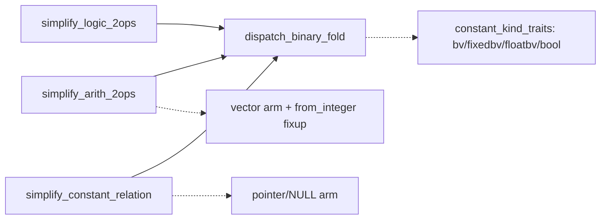

### `string-method-dispatch-single-seam` — collapse ten forwarding dispatchers into one table  ·  Strong  ·  score 22/25 (tied — runner-up candidate)

- **Files** — `src/python-frontend/string/string_handler.cpp:3050-3230` (ten dispatchers called in fixed order), `string/string_method_dispatch.h:11` (ten free-function decls), `string/string_method_handler.cpp` (bodies; 16 `method_name ==` re-matches). Estimate: **~3 files** + regression pins.
- **Score** — **22/25** (leverage 4, locality 4, blast radius 1, heat 5). Heat: `string_method_handler.cpp` 38 commits/90d, `string_handler.cpp` 33, both last touched 2026-08-28.
- **Problem** — Each dispatcher is a method-in-disguise: a 7–9-parameter free function taking the receiver back as an argument plus two `std::function` thunks (`get_receiver_expr`, `get_location`), and re-doing its own `method_name ==` matching. The caller must know the *order* to try the ten. The `has_keyword_unpacking()` guard is copy-pasted six times and applied after only some dispatchers — an inconsistency that is a latent locality bug.
- **Deletion test** — **Moves.** Delete the layer and it folds straight back into `string_handler`; it hides no behaviour, only forwards.
- **Solution** — One `method_name → handler` dispatch table where a handler is uniformly `optional<exprt>(receiver, args, kwargs, location)`; a single `string_method_call` context struct built once replaces the two thunks threaded through nine signatures; the keyword-unpacking guard is applied once at the single dispatch point.
- **Benefits** — *Leverage*: interface drops from "ten functions + their order + two thunks" to one `dispatch(call)`. *Locality*: one guard instead of six. *Test surface*: end-to-end via the large `regression/python/python_str_*` corpus (no unit surface — `string_handler` is coupled to `python_converter`), which is the heavier gate that lost it the tie-break.
- **Before / After**

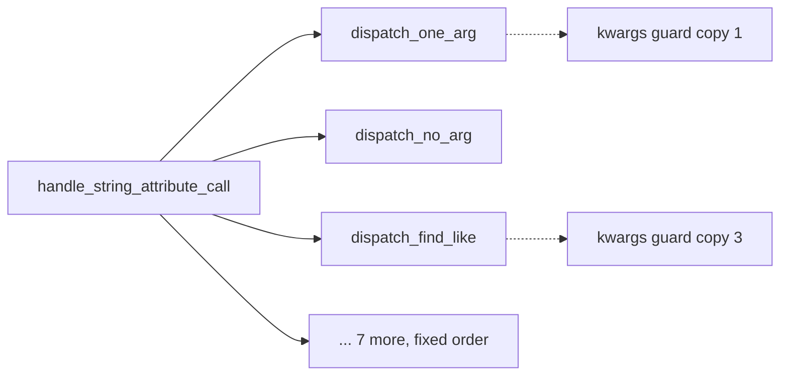

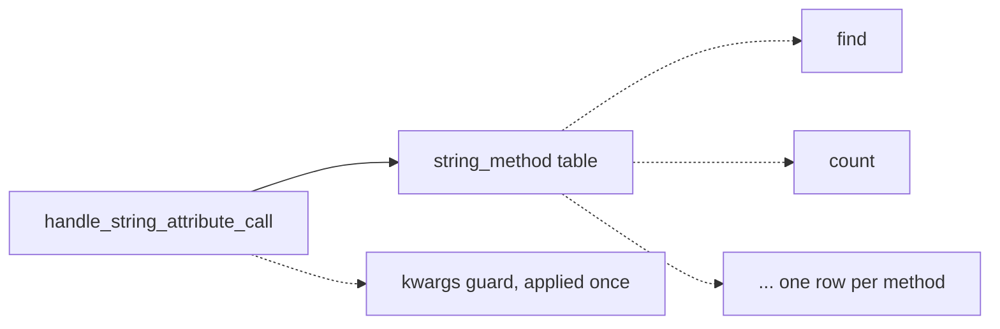

### `list-type-registry-single-seam` — hide the shared `list_type_map` static behind a real registry  ·  Worth exploring  ·  score 22/25

- **Files** — `src/python-frontend/python-list/python_list.h:722` (`friend class python_dict_handler`), `:934` (`static ... list_type_map`); dict reaching across the seam in `python-dict/dict_access.cpp`, `dict_construction.cpp`, `dict_type_resolution.cpp`; magic-string keys `python_dict_handler.h:501,509`. ~17 files across 4 modules. Estimate: **~17 files**.
- **Score** — **22/25** (leverage 5, locality 5, blast radius 3, heat 4). Highest architectural leverage of the set, but blast radius 3 (~17 files) loses the tie-break to the two blast-1 candidates and makes it risky for one unattended PR.
- **Problem** — A single mutable `static` map is the de-facto element-type database for the whole frontend, touched by raw `map[id]...`/`map.find(...)` from 17 files. `python_dict_handler` is a `friend` of `python_list` and stores its own value-type metadata *inside the list's registry* under `$dict_value_types$`-prefixed keys. Two modules share mutable global state through string-key conventions.
- **Deletion test** — The *data* concentrates (the map is load-bearing), but the *interface* is shallow and scattered — a change to storage ripples through 17 files with no owner.
- **Solution** — A `list_type_registry` facade (`record`, `element_type`, `reverse`, `copy`, `uniform_scalar_width`, `flags`), with dict given its own namespaced sub-API instead of magic keys and `friend`.
- **Benefits** — *Leverage*: callers learn ~6 named operations instead of a raw map plus its keying folklore; `friend` disappears. *Locality*: one owner for element-type storage. *Test surface*: the registry becomes directly unit-testable (a pure map-of-types, no `python_converter`).
- **Before / After**

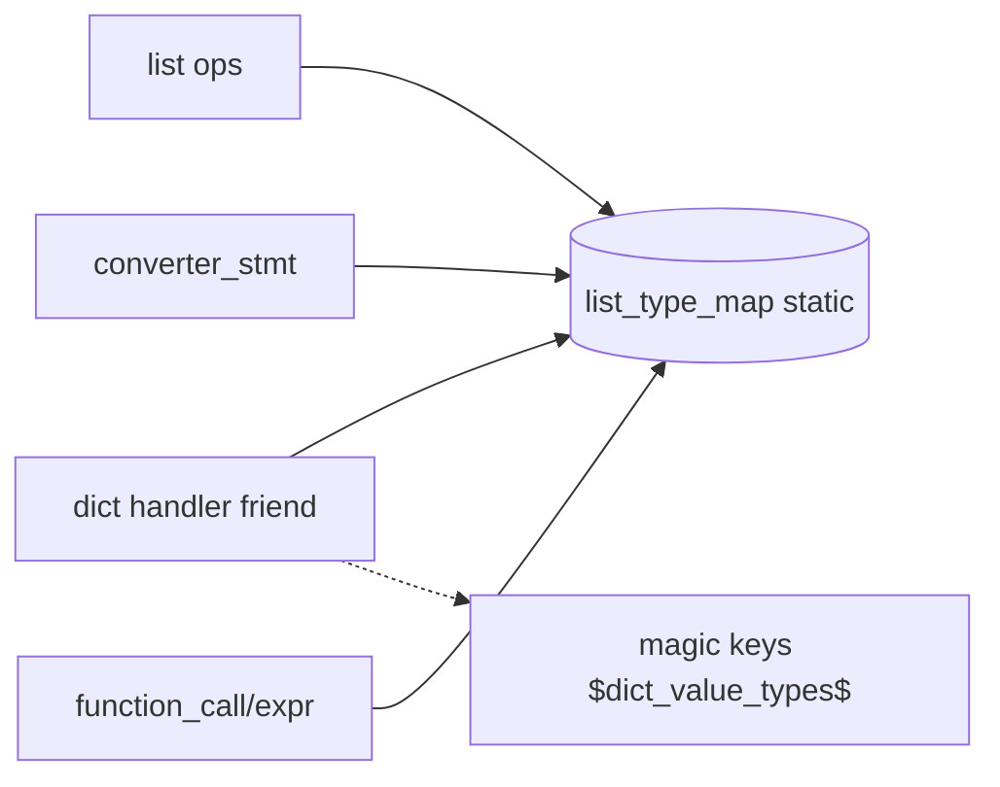

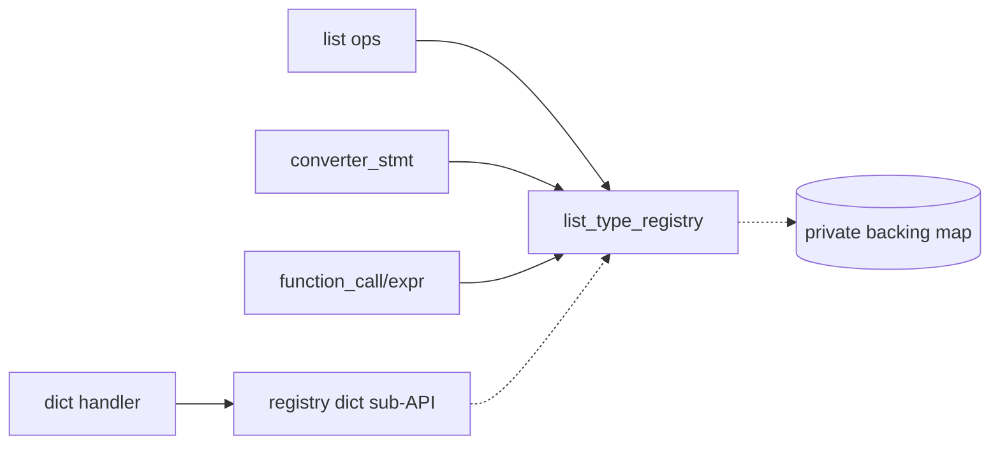

### `function-call-expr-god-object` — promote the builtin dispatch table to a registry of family handlers  ·  Worth exploring  ·  score 21/25

- **Files** — `src/python-frontend/function_call/expr.h:22` (~150 private `handle_*` methods), `:536` (`get_dispatch_table`), `:771-786` (`protected` hooks existing only so `numpy_call_expr` can subclass), `:51` (`friend function_call_expr_test_access`); `expr.cpp` is 7012 lines. Estimate: large; **must be done in per-family slices**.
- **Score** — **21/25** (leverage 5, locality 4, blast radius 4, heat 5 — `expr.cpp` 82 commits/90d, the hottest file in the tree). The whole-class refactor is not one-PR work; a *single family slice* would re-score with a smaller blast radius and is the shape to schedule.
- **Problem** — One class owns the dispatch decision for every Python builtin and dunder. Two tells of too-shallow-for-its-size: NumPy must **subclass** it (forcing `protected` hooks), and the unit test had to add a `friend` to reach `generate_attribute_error`/`method_exists_in_class_hierarchy` — behaviour not reachable through the public interface.
- **Deletion test** — Mixed: the dispatch *table* pulls weight, but most `handle_*` methods are move-able into per-family deep handlers.
- **Solution** — A registry keyed by builtin identity, with families (numeric-conversions, introspection, iterable-reductions, base-conversions) as separate handlers implementing one `handle(call)->optional<exprt>`; `numpy_call_expr` becomes a registered handler, not a subclass. Do it one family per PR.
- **Benefits** — *Leverage*: each family is learned and tested in isolation. *Locality*: the `protected` hooks and the test-access `friend` both disappear as families are extracted. *Test surface*: `unit/python-frontend/function_call_expr_error_test.cpp` can drop its friend once error generation is its own unit — a concrete success metric.
- **Before / After**

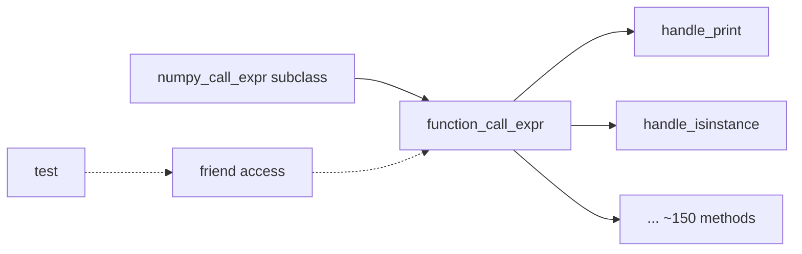

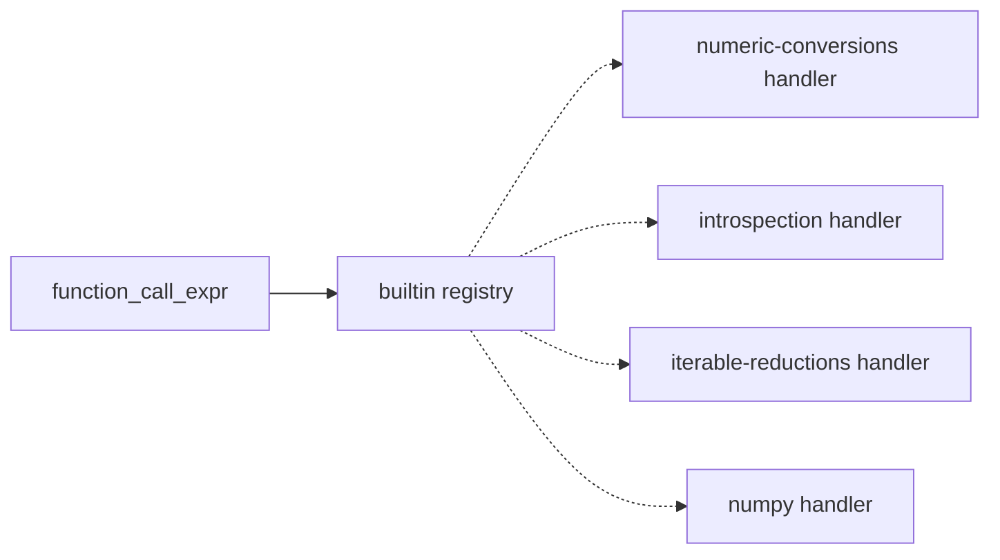

### `reassociate-chain-seam` — collapse five near-identical `reassociate_*` into one entry point  ·  Worth exploring  ·  score 19/25

- **Files** — `src/util/expr/expr_reassociate.cpp:948-1067` (five bodies), `expr_reassociate.h:24,43,66-68` (five decls), sole caller `expr_simplifier.cpp:179-206` (manual five-way `if/else` on `canonical_id`). Estimate: **~3 files**.
- **Score** — **19/25** (leverage 4, locality 4, blast radius 1, heat **2**). The exploring agent read this as hot by association with `expr_simplifier.cpp`, but `expr_reassociate.cpp` itself is cold: 1 commit/90d, last touched 2026-07-25 (~5.5 weeks before HEAD). YAGNI drops the heat and the score with it — the cleanest refactor of the set, but the module it deepens is not changing.
- **Problem** — Four bitwise/mul bodies are one skeleton with five hooks swapped; three header doc-comments literally say *"Same contract as `reassociate_arith`."* The caller re-encodes which kinds reassociate a second time as its `is_arith_chain`/`is_other_chain` gate.
- **Deletion test** — **Concentrates.** The five bodies minus the skeleton are just `{root predicate, safe-type predicate, linearize, optimize, rebuild}` tuples.
- **Solution** — One exported `bool reassociate(expr2tc&)` that routes by kind internally; the caller loses its five-way branch *and* its gate.
- **Benefits** — *Leverage*: interface shrinks five symbols → one; the caller stops needing to know the reassociable-kind set. *Test surface*: pinnable through `expr->simplify()` (existing reassoc cases at `simplify2t.test.cpp:91,133,150,177`) plus direct-call tests on the new entry point.
- **Before / After**

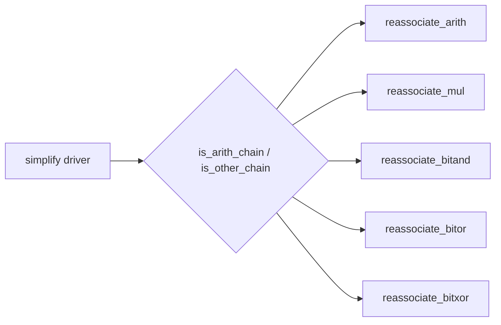

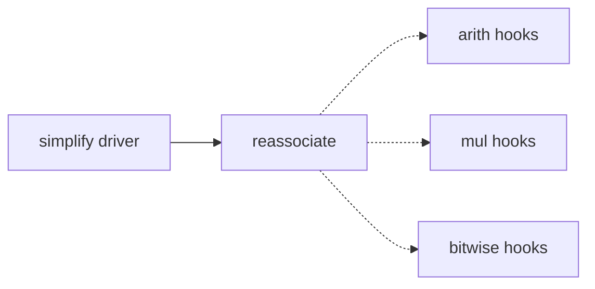

### `numpy-view-methods-out-of-python-list` — move the ndarray-view surface out of the list class  ·  Worth exploring  ·  score 17/25

- **Files** — `src/python-frontend/python-list/python_list.h:94-305` (~14 numpy ndarray-view methods, `public` only so `numpy_call_expr` can call them), bodies in `python-list/list_access.cpp`, callers in `numpy/numpy_call_expr.cpp`. Estimate: **~4-6 files**.
- **Score** — **17/25** (leverage 3, locality 3, blast radius 2, heat 4).
- **Problem** — `python_list`'s public interface conflates Python `list` operations with NumPy fixed-shape ndarray-view construction (diagonal/trace/ravel/fancy-index/mask); a reader learning "what is a Python list here" wades through 200+ lines of strided-pointer-view contracts.
- **Deletion test** — **Moves cleanly** — the methods already have a single external caller cluster (`numpy_call_expr`) and belong beside it.
- **Solution** — A `numpy_view_builder` (or fold into `numpy/`) owning fixed-shape-array view construction; `python_list` keeps only list semantics.
- **Benefits** — *Leverage*: the list interface shrinks substantially. *Locality*: numpy view logic gets one home. *Test surface*: `regression/python/` numpy cases pin the verdicts before/after.
- **Before / After**

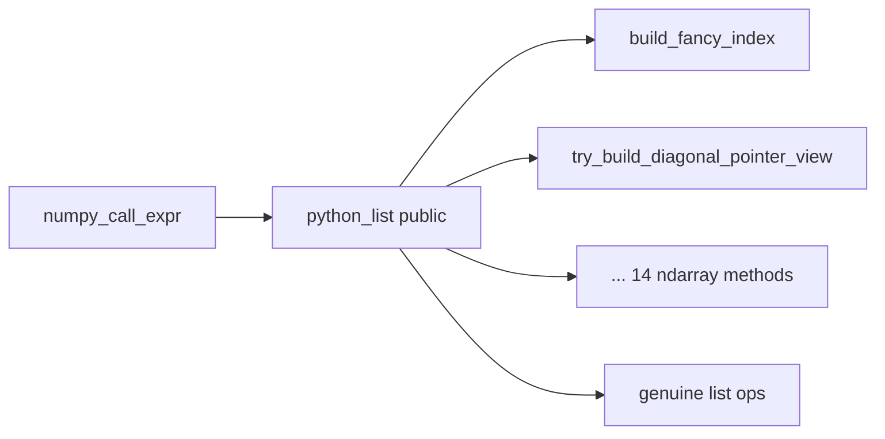

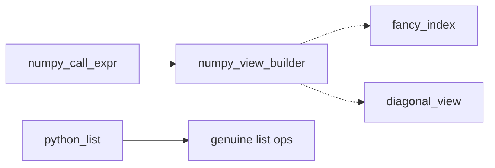

## Dropped

| Candidate | Dropped because |
|---|---|
| `irep2-adjust-mode-seam` | Leverage 1 — fails the deletion test. `clang_c_adjust_irep2` is a transitional bridge the header (`:7-12`) states will replace and delete the legacy `clang_c_adjust` pass; unifying the two adjusters or building a shared kind→handler table across them would *spread* logic into a seam scheduled for demolition (complexity **moves**, not concentrates). The genuinely-shallow sub-item (`statement_location`'s 13-arm switch) is only fixable by adding a polymorphic `location()` to the central published `irep2.h`, which is out of scope. Recorded so the next run does not re-derive it. |

## Too large to automate

None at blast radius 5 (no repo-wide rename or migration surfaced). `function-call-expr-god-object` (blast 4) is close in spirit — it is real but not one-PR work; it stays a scored candidate with the standing note that it must be scheduled one family-slice per PR.

## Pick

**`constant-kind-dispatch-seam` (22/25).** The tie-break decided this run: three candidates tied at 22/25 (`constant-kind-dispatch-seam`, `string-method-dispatch-single-seam`, `list-type-registry-single-seam`).

1. *Lower blast radius* eliminates `list-type-registry` (blast 3, ~17 files) — too large to review safely in one unattended PR.
2. Between the two blast-1 candidates, *heat* ties at 5, so *most-recently-touched* decides: `expr_simplifier.cpp` was last touched 2026-08-31 versus the string files' 2026-08-28.

**The pick was close** — the runner-up **candidate**, `string-method-dispatch-single-seam`, is tied on score and is the natural next firing. It lost only on recency and on having no unit-test surface (it is pinnable end-to-end via `regression/python/` but not through a focused Catch2 test), which makes its quality gate heavier for an unattended run. The pick was additionally confirmed feasible by reading all four ladders directly: a single `dispatch_binary_fold<TFunctor, Wrap>` seam serves the three two-operand ladders with **no functor rewritten** and each caller's extras (vector arm, `from_integer` fixup, pointer/NULL arm) kept caller-side, so leverage 4 / blast 1 / ~2 files hold and the tie does not flip.

## Design

Three interfaces were designed in parallel by independent sub-agents, then adjudicated by the orchestrator (which authored none of them) against the fixed criteria in priority order: **depth → locality → seam placement → test surface → blast radius**.

A fact both A and C established by reading the code is load-bearing for every design: **`Modtor<ieee_floatt>` does not compile** — `ieee_floatt` (`src/util/arith/ieee_float.h`) has no `operator%=`, and `DivModtor::simplify` does `get_value(c1) %= get_value(c2)`. An always-four-arm seam would odr-use `Modtor<ieee_floatt>` via `simplify_arith_2ops<Modtor,…>`. So the floatbv arm **must be removable at compile time** for the arith caller; this is why `simplify_arith_2ops` asserts `!is_floatbv_type(type)` today. C additionally corrected the brief's efficiency premise: the current `is_constant`/`get_value` are a function pointer and a captureless lambda, both of which fit `std::function`'s small-buffer optimisation, so **there is no heap allocation to remove** — the only cost is a non-inlined indirect call, marginal against expr-node allocation and SMT solving. The true two-operand functor count on this seam is **14** (8 arith/logic + 6 relation), not the ~26 structs in the file.

### Design A — minimal surface (WINNER)

- **Interface** — one file-local seam:
  ```cpp
  template <class V> using by_value = V;    // arith, logic
  template <class V> using by_ref   = V &;  // relation
  template <template <class> class TFunctor,
            template <class> class Wrap  = by_value,
            bool                   Floats = true>
  static std::optional<expr2tc> dispatch_binary_fold(const expr2tc &s1, const expr2tc &s2);
  ```
  Two orthogonal template knobs — `Wrap` (value vs reference functor instantiation) and `Floats` (`if constexpr` excludes the floatbv arm so `Modtor<ieee_floatt>` is never formed) — are the floor: each names exactly one of the two ways the callers deviate from the shared `{bv, fixedbv, floatbv, bool}` core. `std::optional` carries three states (`nullopt` = no arm matched; `optional{nil}` = matched, functor declined; `optional{expr}` = folded).
- **What it hides** — the entire four-arm runtime type ladder *and* the 12→1 collapse of the per-kind `(predicate, accessor, carrier, Wrap)` mapping. A caller learns one function plus at most two named knobs.
- **Dependency strategy** — functor and both knobs are compile-time template parameters; per-kind traits are internal, so the caller never names them.
- **Trade-offs** — keeps `std::function` (no functor rewrite, no allocation change); `std::optional` is a third return state, but only `simplify_constant_relation` branches on it — and it *must*, to preserve the pointer arm's `else-if` fidelity.

### Design B — trait registry (eliminated)

- **Interface** — `enum class ckind`, `constant_kind_traits<K>` specialisations (bv/fixedbv/floatbv/boolean/**pointer**), a `functor_arg<F,K>` value-vs-reference metafunction, `kind_set<Ks...>` ordered packs, and `dispatch(kind_set, a, b) -> fold_outcome{result, kind, matched}`. The pointer/NULL arm becomes a registry row.
- **Strength** — adding a constant kind is a one-line trait + alias edit; the accepted-kinds set and order are inspectable in one place.
- **Why it lost** — most machinery of the three (largest diff, still blast 1); its own author flagged **over-engineering** — `git log` shows the last constant kind (floatbv) was added 2016, ~9 years stable — and the design is allocation-neutral, so the flexibility optimises an axis that has not moved. Folding the bespoke pointer/NULL arm into a uniform registry row is a **forced seam** where the thing does not actually vary uniformly ("the odd row"). Loses on seam placement and blast radius; ties depth but at a larger interface.

### Design C — common-caller / efficiency (RUNNER-UP DESIGN)

- **Interface** — named descriptor structs (`int_kind`/`fixedbv_kind`/`floatbv_kind`/`bool_kind`, each with `value_type` + `is()` + `value()`) and two 3-line seam helpers, `fold_2op<TFunctor, Kind>` (value) and `fold_rel<TFunctor, Kind>` (reference). The caller keeps its own `if (is_bv_type…) else if …` ladder; only each arm's *body* collapses to one line. Recommended the conservative variant (function-pointer descriptors, **zero** functor-signature edits) over an aggressive variant that templatises 14 functor signatures to drop `std::function` — correctly, since there is no allocation to remove.
- **Why it is the runner-up and not the winner** — it is the lowest-risk to verify (it preserves each caller's `if/else` ladder literally, so behaviour-preservation is trivially inspectable) and its descriptor structs cleanly drop the C-style overload-resolution casts. But on the **top two criteria** it loses: it leaves the four-arm type-dispatch **ladder triplicated across the three callers**, so it deepens the arm body without concentrating the dispatch. Depth and locality are exactly the axes this refactor exists to move, and C only half-moves them.

### Verdict and the design that is implemented

**Design A wins on the two highest-priority criteria (depth, locality)** — it is the only design that removes the triplicated type-dispatch ladder from the callers, which *is* the shallowness the pick set out to fix — with well-placed seam knobs that name verified variation, at blast radius 1. It is implemented with one refinement borrowed from **C**: source each kind's `(is_const, value)` pair from small file-local descriptor structs rather than inline C-style casts, dropping the `(bool (*)(const expr2tc &))` / `(constant_int2t & (*)(expr2tc &))` disambiguation casts. The refined spec step 5 implements:

- File-local `constant_kind_traits` descriptors per kind (bv→BigInt, fixedbv→fixedbvt, floatbv→ieee_floatt, bool→bool), each exposing `is_type`, `is_const`, `value` with unambiguous signatures.
- `dispatch_binary_fold<TFunctor, Wrap = by_value, bool Floats = true>(s1, s2) -> std::optional<expr2tc>`, four arms, `if constexpr (Floats)` guarding the floatbv arm.
- Callers keep, caller-side: `simplify_arith_2ops` — its vector arm, `assert(!floatbv)`, `from_integer` bv fixup, and `Floats = false`; `simplify_constant_relation` — its pointer/NULL arm, `Wrap = by_ref`, and the `optional`-guarded fall-through; `simplify_logic_2ops` — nothing, it becomes one call.
- `simplify_arith_1op` (one operand, whole-constant accessor, no bool arm) is **scoped out** — a distinct contract; folding it in would force a functor rewrite.

Behaviour is preserved: no functor struct is rewritten, and each caller's residue reproduces its original special-casing exactly. Verification is through the existing public interface `expr->simplify()` (Catch2 `unit/util/simplify2t.test.cpp`), after first adding the currently-absent `fixedbv`/`floatbv` fold pins and mutation-checking them.
