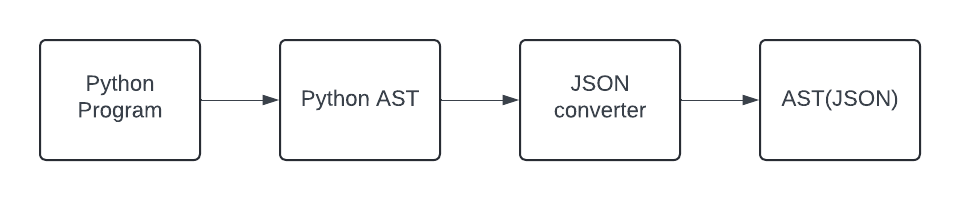
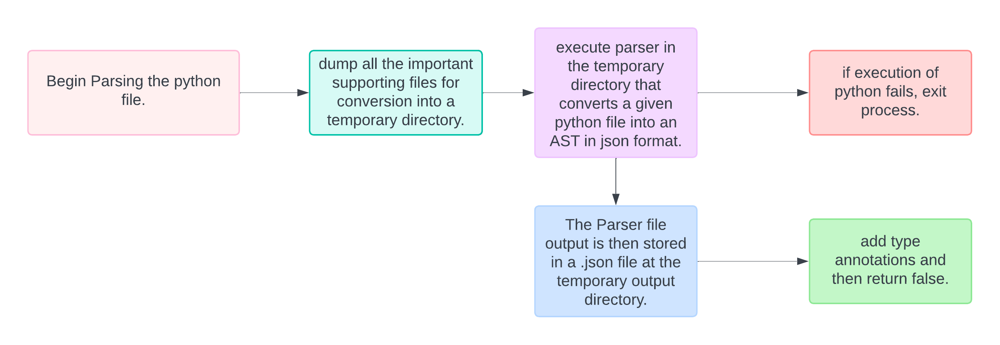

# The python frontend

## Introduction

The python frontend of ESBMC converts a given python code to pass the input python code to the control-flow graph generator in the form of an Abstract Syntax Tree (AST). This is achieved by scanning the given code using the ast2json library available for python.

The rest of the ESBMC architecture then handles the conversion of this AST to GOTO statements and SSA (Single Static Assignments), which are then checked for satisfiability by converting them into SMT formulas. This documentation will cover the process of ast2json conversion, and how the given program is converted into an AST.



## The frontend workflow



The entry-point for the frontend is the function that parses the python file. It handles the parsing of a given python code into the AST, the other python scripts and cpp files support the process with functions defined to handle the syntax and programming functions of python.

Let us take a detailed look at each step of the process in the sections below with a working example.

## The parsing process

The parsing function first checks if the python script passed exists in the given file path. If it exists, then it calls a function to dump all supporting files into a temporary output directory, and stores the returned value in a variable which is the path to the output directory.

This directory also contains all the other supporting python scripts that helps parse the python file and pre-processors that 

After the required modules are dumped in the directory, the parser script is executed to generate the .json file from the AST. The resulting .json file is now stored in the temporary directory.

The file is then parsed, and a AST is generated, which is traversed and for each node function, type annotations are added using the other supporting files in the python frontend.

It ends with the parsing function returning the value false, if everything works as intended.

## The parser script

The parser python script handles the conversion of the given python script into the .json file by converting it into an abstract syntax tree first.

The two main arguments that are passed on to the file during execution is the python file to be analysed and the path to the output directory.

The parser also includes the current directory it is in to account for all the process imports that it has to search through. Then, it opens the given python file and converts it into an abstract syntax tree using the function `parse` from the ast library.

The resulting tree is then subjected to some essential transformations to the loops defined in the program. This process is termed as pre-processing.

after pre-processing, the tree is then traversed where the process imports and type annotations are handled. The AST of the main python file is then converted into a proper json format. Then, the memory models defined in the model directory is also converted into proper json AST file and stored in the temporary output directory.

The `ast2json.ast2json()` function is used here to convert the python AST. The result is then written into the appropriate .json file.

The function converts any process import nodes in the AST node and generates appropriate json files for the imported elements.

## The preprocessor

The Preprocessor contains definitions for functions that are used to convert the for loops detected in the tree to be converted into while loops, with the proper conversion of conditions for the loop iterations.

## Example

Let us take a simple python code to observe the conversion of the code into AST.

Take for example, the python code below,

```
class MyClass:
    @classmethod
    def my_method(cls) -> int:
        return 1

assert MyClass.my_method() == 2

```

The esbmc converts the following code to first an AST :

```
Module(
    body=[
        ClassDef(
            name='MyClass',
            bases=[],
            keywords=[],
            body=[
                FunctionDef(
                    name='my_method',
                    args=arguments(
                        posonlyargs=[],
                        args=[
                            arg(
                                arg='cls',
                                lineno=3,
                                col_offset=18,
                                end_lineno=3,
                                end_col_offset=21)],
                        kwonlyargs=[],
                        kw_defaults=[],
                        defaults=[]),
                    body=[
                        Return(
                            value=Constant(
                                value=1,
                                lineno=4,
                                col_offset=15,
                                end_lineno=4,
                                end_col_offset=16),
                            lineno=4,
                            col_offset=8,
                            end_lineno=4,
                            end_col_offset=16)],
                    decorator_list=[
                        Name(
                            id='classmethod',
                            ctx=Load(),
                            lineno=2,
                            col_offset=5,
                            end_lineno=2,
                            end_col_offset=16)],
                    returns=Name(
                        id='int',
                        ctx=Load(),
                        lineno=3,
                        col_offset=26,
                        end_lineno=3,
                        end_col_offset=29),
                    lineno=3,
                    col_offset=4,
                    end_lineno=4,
                    end_col_offset=16)],
            decorator_list=[],
            lineno=1,
            col_offset=0,
            end_lineno=4,
            end_col_offset=16),
        Assert(
            test=Compare(
                left=Call(
                    func=Attribute(
                        value=Name(
                            id='MyClass',
                            ctx=Load(),
                            lineno=6,
                            col_offset=7,
                            end_lineno=6,
                            end_col_offset=14),
                        attr='my_method',
                        ctx=Load(),
                        lineno=6,
                        col_offset=7,
                        end_lineno=6,
                        end_col_offset=24),
                    args=[],
                    keywords=[],
                    lineno=6,
                    col_offset=7,
                    end_lineno=6,
                    end_col_offset=26),
                ops=[
                    Eq()],
                comparators=[
                    Constant(
                        value=2,
                        lineno=6,
                        col_offset=30,
                        end_lineno=6,
                        end_col_offset=31)],
                lineno=6,
                col_offset=7,
                end_lineno=6,
                end_col_offset=31),
            lineno=6,
            col_offset=0,
            end_lineno=6,
            end_col_offset=31)],
    type_ignores=[])
    
```

Then after pre-processing :

```
Module(
    body=[
        ClassDef(
            name='MyClass',
            bases=[],
            keywords=[],
            body=[
                FunctionDef(
                    name='my_method',
                    args=arguments(
                        posonlyargs=[],
                        args=[
                            arg(
                                arg='cls',
                                lineno=3,
                                col_offset=18,
                                end_lineno=3,
                                end_col_offset=21)],
                        kwonlyargs=[],
                        kw_defaults=[],
                        defaults=[]),
                    body=[
                        Return(
                            value=Constant(
                                value=1,
                                lineno=4,
                                col_offset=15,
                                end_lineno=4,
                                end_col_offset=16),
                            lineno=4,
                            col_offset=8,
                            end_lineno=4,
                            end_col_offset=16)],
                    decorator_list=[
                        Name(
                            id='classmethod',
                            ctx=Load(),
                            lineno=2,
                            col_offset=5,
                            end_lineno=2,
                            end_col_offset=16)],
                    returns=Name(
                        id='int',
                        ctx=Load(),
                        lineno=3,
                        col_offset=26,
                        end_lineno=3,
                        end_col_offset=29),
                    lineno=3,
                    col_offset=4,
                    end_lineno=4,
                    end_col_offset=16)],
            decorator_list=[],
            lineno=1,
            col_offset=0,
            end_lineno=4,
            end_col_offset=16),
        Assert(
            test=Compare(
                left=Call(
                    func=Attribute(
                        value=Name(
                            id='MyClass',
                            ctx=Load(),
                            lineno=6,
                            col_offset=7,
                            end_lineno=6,
                            end_col_offset=14),
                        attr='my_method',
                        ctx=Load(),
                        lineno=6,
                        col_offset=7,
                        end_lineno=6,
                        end_col_offset=24),
                    args=[],
                    keywords=[],
                    lineno=6,
                    col_offset=7,
                    end_lineno=6,
                    end_col_offset=26),
                ops=[
                    Eq()],
                comparators=[
                    Constant(
                        value=2,
                        lineno=6,
                        col_offset=30,
                        end_lineno=6,
                        end_col_offset=31)],
                lineno=6,
                col_offset=7,
                end_lineno=6,
                end_col_offset=31),
            lineno=6,
            col_offset=0,
            end_lineno=6,
            end_col_offset=31)],
    type_ignores=[])
    
```

Finally, after converting it into JSON format, we get :

```
{
    "_type": "Module",
    "body": [
        {
            "_type": "FunctionDef",
            "args": {
                "_type": "arguments",
                "args": [
                    {
                        "_type": "arg",
                        "annotation": {
                            "_type": "Name",
                            "col_offset": 28,
                            "ctx": {
                                "_type": "Load"
                            },
                            "end_col_offset": 31,
                            "end_lineno": 1,
                            "id": "int",
                            "lineno": 1
                        },
                        "arg": "curr",
                        "col_offset": 22,
                        "end_col_offset": 31,
                        "end_lineno": 1,
                        "lineno": 1,
                        "type_comment": null
                    },
                    {
                        "_type": "arg",
                        "annotation": {
                            "_type": "Name",
                            "col_offset": 39,
                            "ctx": {
                                "_type": "Load"
                            },
                            "end_col_offset": 42,
                            "end_lineno": 1,
                            "id": "int",
                            "lineno": 1
                        },
                        "arg": "step",
                        "col_offset": 33,
                        "end_col_offset": 42,
                        "end_lineno": 1,
                        "lineno": 1,
                        "type_comment": null
                    }
                ],
                "defaults": [],
                "kw_defaults": [],
                "kwarg": null,
                "kwonlyargs": [],
                "posonlyargs": [],
                "vararg": null
            },
            "body": [
                {
                    "_type": "Return",
                    "col_offset": 2,
                    "end_col_offset": 20,
                    "end_lineno": 2,
                    "lineno": 2,
                    "value": {
                        "_type": "BinOp",
                        "col_offset": 9,
                        "end_col_offset": 20,
                        "end_lineno": 2,
                        "left": {
                            "_type": "Name",
                            "col_offset": 9,
                            "ctx": {
                                "_type": "Load"
                            },
                            "end_col_offset": 13,
                            "end_lineno": 2,
                            "id": "curr",
                            "lineno": 2
                        },
                        "lineno": 2,
                        "op": {
                            "_type": "Add"
                        },
                        "right": {
                            "_type": "Name",
                            "col_offset": 16,
                            "ctx": {
                                "_type": "Load"
                            },
                            "end_col_offset": 20,
                            "end_lineno": 2,
                            "id": "step",
                            "lineno": 2
                        }
                    }
                }
            ],
            "col_offset": 0,
            "decorator_list": [],
            "end_col_offset": 20,
            "end_lineno": 2,
            "lineno": 1,
            "name": "ESBMC_range_next_",
            "returns": {
                "_type": "Name",
                "col_offset": 47,
                "ctx": {
                    "_type": "Load"
                },
                "end_col_offset": 50,
                "end_lineno": 1,
                "id": "int",
                "lineno": 1
            },
            "type_comment": null
        },
        {
            "_type": "FunctionDef",
            "args": {
                "_type": "arguments",
                "args": [
                    {
                        "_type": "arg",
                        "annotation": {
                            "_type": "Name",
                            "col_offset": 32,
                            "ctx": {
                                "_type": "Load"
                            },
                            "end_col_offset": 35,
                            "end_lineno": 4,
                            "id": "int",
                            "lineno": 4
                        },
                        "arg": "curr",
                        "col_offset": 26,
                        "end_col_offset": 35,
                        "end_lineno": 4,
                        "lineno": 4,
                        "type_comment": null
                    },
                    {
                        "_type": "arg",
                        "annotation": {
                            "_type": "Name",
                            "col_offset": 42,
                            "ctx": {
                                "_type": "Load"
                            },
                            "end_col_offset": 45,
                            "end_lineno": 4,
                            "id": "int",
                            "lineno": 4
                        },
                        "arg": "end",
                        "col_offset": 37,
                        "end_col_offset": 45,
                        "end_lineno": 4,
                        "lineno": 4,
                        "type_comment": null
                    },
                    {
                        "_type": "arg",
                        "annotation": {
                            "_type": "Name",
                            "col_offset": 53,
                            "ctx": {
                                "_type": "Load"
                            },
                            "end_col_offset": 56,
                            "end_lineno": 4,
                            "id": "int",
                            "lineno": 4
                        },
                        "arg": "step",
                        "col_offset": 47,
                        "end_col_offset": 56,
                        "end_lineno": 4,
                        "lineno": 4,
                        "type_comment": null
                    }
                ],
                "defaults": [],
                "kw_defaults": [],
                "kwarg": null,
                "kwonlyargs": [],
                "posonlyargs": [],
                "vararg": null
            },
            "body": [
                {
                    "_type": "Return",
                    "col_offset": 2,
                    "end_col_offset": 27,
                    "end_lineno": 5,
                    "lineno": 5,
                    "value": {
                        "_type": "Compare",
                        "col_offset": 9,
                        "comparators": [
                            {
                                "_type": "Name",
                                "col_offset": 24,
                                "ctx": {
                                    "_type": "Load"
                                },
                                "end_col_offset": 27,
                                "end_lineno": 5,
                                "id": "end",
                                "lineno": 5
                            }
                        ],
                        "end_col_offset": 27,
                        "end_lineno": 5,
                        "left": {
                            "_type": "BinOp",
                            "col_offset": 9,
                            "end_col_offset": 20,
                            "end_lineno": 5,
                            "left": {
                                "_type": "Name",
                                "col_offset": 9,
                                "ctx": {
                                    "_type": "Load"
                                },
                                "end_col_offset": 13,
                                "end_lineno": 5,
                                "id": "curr",
                                "lineno": 5
                            },
                            "lineno": 5,
                            "op": {
                                "_type": "Add"
                            },
                            "right": {
                                "_type": "Name",
                                "col_offset": 16,
                                "ctx": {
                                    "_type": "Load"
                                },
                                "end_col_offset": 20,
                                "end_lineno": 5,
                                "id": "step",
                                "lineno": 5
                            }
                        },
                        "lineno": 5,
                        "ops": [
                            {
                                "_type": "LtE"
                            }
                        ]
                    }
                }
            ],
            "col_offset": 0,
            "decorator_list": [],
            "end_col_offset": 27,
            "end_lineno": 5,
            "lineno": 4,
            "name": "ESBMC_range_has_next_",
            "returns": {
                "_type": "Name",
                "col_offset": 61,
                "ctx": {
                    "_type": "Load"
                },
                "end_col_offset": 65,
                "end_lineno": 4,
                "id": "bool",
                "lineno": 4
            },
            "type_comment": null
        }
    ],
    "type_ignores": [],
    "filename": "range.py",
    "ast_output_dir": "/tmp/esbmc-python-astgen-c047-b83c-a705"
}

```
