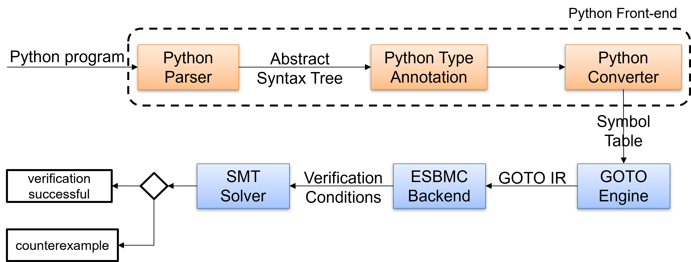

# ESBMC Python Front-end

## Overview

The Python frontend handles the conversion of Python code into an internal representation, which is then translated into the GOTO language. This process includes three key steps:

1. Generating an Abstract Syntax Tree (AST) in JSON format.
2. Annotating the AST with type information.
3. Translating Python statements into a set of symbols in the Intermediate Representation (IRep) format.

The ESBMC backend finalizes the conversion by performing symbolic execution on the GOTO program, producing instructions in Single Static Assignment (SSA) form.
Following symbolic execution, we generate a first-order logic formula, which an SMT solver discharges. </br></br>

<p align="center">
  
</p>

<p align="center"><em>Python Front-end Architecture</em></p>


## AST Generation

The translation of Python code starts by parsing .py files into an AST. This is achieved using the [ast](https://docs.python.org/3/library/ast.html) and [ast2json](https://pypi.org/project/ast2json/) modules, which generate the AST in JSON format. The process runs alongside the Python interpreter, producing a JSON file for each Python file, including imported modules.

This approach's main advantage is that it utilizes a native Python module, ensuring adherence to the language.

## Type Annotation

After generating the AST, we add JSON nodes with type information. [PEP 484](https://peps.python.org/pep-0484/) introduced an optional type system, allowing developers to annotate variables using the format **`var-name:type`**.

Our method involves traversing the AST and replacing assignments with their corresponding type-annotated nodes. The figure below shows the representation for <code>x:int = 10</code>.

```json
{
    "_type": "AnnAssign",
    "annotation": {
        "_type": "Name",
        "col_offset": 2,
        "ctx": {
            "_type": "Load"
        },
        "end_col_offset": 5,
        "end_lineno": 1,
        "id": "int",
        "lineno": 1
    },
    "target": {
        "_type": "Name",
        "col_offset": 0,
        "ctx": {
            "_type": "Store"
        },
        "end_col_offset": 1,
        "end_lineno": 1,
        "id": "x",
        "lineno": 1
    },
    "value": {
        "_type": "Constant",
        "col_offset": 8,
        "end_col_offset": 10,
        "end_lineno": 1,
        "kind": null,
        "lineno": 1,
        "n": 10,
        "s": 10,
        "value": 10
    }
}
```

We can infer type from constants, variables with inferred or pre-annotated types, binary expressions, and class instances.


## Symbol Table Generation
The final step in the frontend involves converting the annotated JSON AST into a symbol table using our C++ IRep API. This API enables the creation of a control-flow graph (CFG) from the program, allowing us to model constructs such as assignments, expressions, conditionals, loops, functions, and classes. The resulting information is stored in a context structure, which serves as the input for the GOTO conversion process.

## Features Supported by ESBMC-Python

Below is an overview of ESBMC-Python key capabilities:

### Basic Constructs
- **Control Structures**: Supports conditional statements (`if-else`) and loops (`for`, `while`).
- **Arithmetic**: Includes standard arithmetic operations (e.g., addition, subtraction, multiplication, division).
- **Logical Operations**: Supports logical constructs (e.g., `AND`, `OR`, `NOT`).

### Functions and Methods
- **Function Handling**: This allows for defining, calling, and verifying functions, including parameter passing and return values.
- **Annotations**: Supports type annotations.
### Object-Oriented Programming
- **Classes**: Supports class definitions, methods, and attributes.
- **Inheritance**: Handles inheritance and verifies scenarios involving inheritance issues.
### Data Types and Structures
- **Dynamic Typing**: Accommodates Python's dynamic typing in variable assignments.
- **Data Structures**: Supports operations on Python's built-in data structures, such as lists and strings, including concatenation and bounds checks.
- **Bytes and Integers**: Supports bytes and integer operations, such as conversions and bit length.
### Error Handling and Assertions
- **Assertions**: Supports `assert` statements for program verification.
- **Assumptions**: Supports `assume` statements for specifying assumptions for verification.

### Additional Capabilities
- **Nondeterministic Variables**: Models nondeterminism to explore multiple execution paths.
- **Recursion**: Supports and verifies recursive functions.
- **Imports**: Handles import styles and validates their usage.
- **Numeric Types**: Supports manipulation of numeric types (e.g., bytes, integers, floats).
- **Built-in Functions**: Supports Python's built-in functions, such as `len` and `range`.
- **Verification properties**: Division-by-zero, indexing errors, arithmetic overflow, and user-defined assertions.


## References
For more information about our frontend, please refer to our ISSTA 2024 [tool paper](https://dl.acm.org/doi/abs/10.1145/3650212.3685304).
