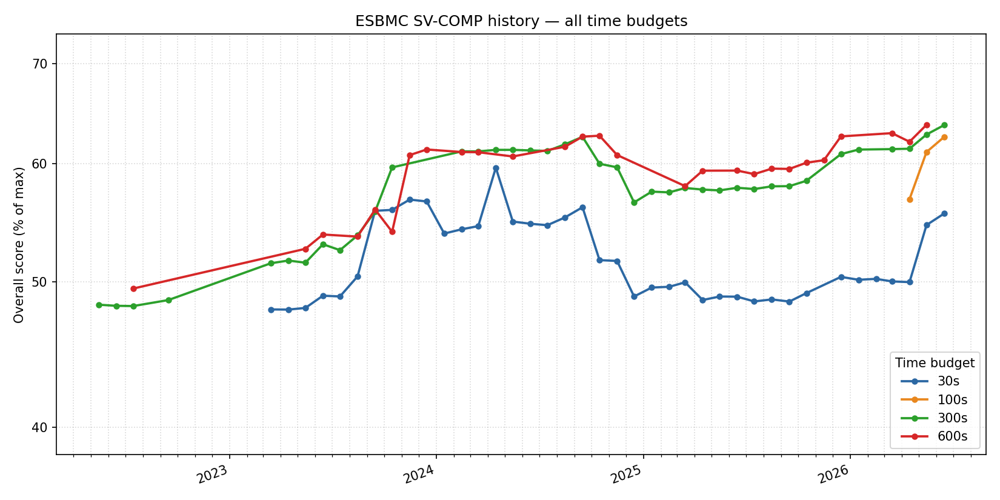

 **NEW:** We have rewritten and
cleaned up the docs, read more [here](/news/docs-page-improvement).













ESBMC is a mature, permissively licensed open-source SMT-based context-bounded
model checker for single and multi-threaded C, C++, CUDA, CHERI, Kotlin, Python,
Rust, and Solidity programs. It automatically detects or proves the absence of
runtime errors (e.g., bounds checks, pointer safety, overflow) and verifies
user-defined assertions without requiring pre- or postconditions. For
multi-threaded programs, ESBMC supports lazy and schedule-recording approaches,
encoding verification conditions into SMT formulas solved directly by an SMT
solver.

## Download



 


 

 


 

  macOS
does not have any downloadable builds at the moment. You can however build from
scratch using our [build](docs/development/building) guide. 


 

  FreeBSD
does not have any downloadable builds at the moment. You can however build from
scratch using our [build](docs/development/building) guide. 


 



## Features

ESBMC aims to support all C features up to version 14, and detects errors in
software by simulating a finite prefix of the program execution with all
possible inputs. Classes of problems that can be detected include:

- The Clang compiler as its C/C++/CHERI/CUDA frontend;
- The Soot framework via Jimple as its Java/Kotlin frontend;
- The [ast](https://docs.python.org/3/library/ast.html) and
  [ast2json](https://pypi.org/project/ast2json/) modules as its
  [Python frontend](./src/python-frontend/README.md); the first SMT-based
  bounded model checker for Python programs;
- Implements the Solidity grammar production rules as its Solidity frontend;
- Supports IEEE floating-point arithmetic for various SMT solvers.

ESBMC implements state-of-the-art incremental BMC and _k_-induction proof-rule
algorithms based on Satisfiability Modulo Theories (SMT) and Constraint
Programming (CP) solvers.

We provide some background material/publications to help you understand what
ESBMC can offer. These are available
[online](https://ssvlab.github.io/esbmc/publications.html). For further
information about our main components, check the ESBMC
[architecture](https://github.com/esbmc/esbmc/blob/master/ARCHITECTURE.md).

## SV-COMP History



Overall [SV-COMP](/sv-comp) score over time, by per-benchmark time budget.

## Applications

ESBMC has been used in a broad range of cutting-edge applications across
multiple domains. If you applied ESBMC in your research, but it is not mentioned
below, please, do not hesitate to contact us through our
[GitHub repository](https://github.com/esbmc/esbmc).

## CBMC Differences

ESBMC and [CBMC](https://www.cprover.org/cbmc/) share a common ancestry but have
diverged substantially. The list below reflects the current state of ESBMC
(release 7.x) and contrasts it with mainline CBMC.

**Frontends and language support.**

- ESBMC uses the Clang/LLVM front-end for C (up to C23), C++ (up to C++20), CUDA
  and CHERI-C, inheriting Clang's diagnostics, attribute handling and template
  instantiation. CBMC still relies on its own in-tree C and C++ parsers, which
  lag behind Clang on modern language features (e.g. C++17/20 templates,
  structured bindings, `if constexpr`).
- ESBMC ships dedicated frontends for **Python 3.10+** (the first BMC-based
  Python-code verifier), **Solidity** (smart contracts) and **Kotlin/Java** (via
  the Soot/Jimple IR), with ongoing work on a **Rust** frontend. CBMC supports
  only C/C++ in the main tool; Java is handled by the separate JBMC project and
  Rust by Kani.

**Verification backend.**

- ESBMC encodes programs directly into SMT and supports multiple solver backends
  — Z3, Bitwuzla (default), Boolector, CVC4/CVC5, Yices, MathSAT and any SMT-LIB
  v2 solver — exploiting native theories for arrays, bit-vectors, floating-point
  and quantifiers. CBMC focuses on SAT-based encodings of fully unrolled
  programs (its built-in solver is based on MiniSat), with external SMT solvers
  used in a more limited role.
- ESBMC integrates an interval-arithmetic abstract domain that can prune loop
  unwindings (`--interval-symex-guard`) and discharge assertions proved true by
  the abstract semantics (`--interval-symex-assert`), reducing the size of the
  SMT formula handed to the solver.

**Proof techniques.**

- ESBMC implements incremental BMC, _k_-induction and bidirectional
  _k_-induction in a single invocation, combining base-case, forward-condition
  and inductive-step checks in one run. CBMC's _k_-induction workflow
  historically requires three separate passes (CFG construction, program
  annotation, verification) and lacks the forward condition needed to prove that
  all reachable states have been covered, relying on bounded unwinding instead.
- ESBMC supports function contracts (`__ESBMC_assume`, `__ESBMC_assert`,
  pre/post-conditions) and LLM-assisted invariant generation for loops that
  cannot be unrolled within a budget.

**Concurrency verification.**

- ESBMC explores thread interleavings explicitly under context-bounded
  verification, with both **lazy** and **schedule-recording** exploration
  strategies and a partial-order reduction (POR) pass that prunes independent
  interleavings. This typically scales better than CBMC's single-formula
  encoding of the whole concurrent program on programs with many interleaving
  points.
- ESBMC ships models for POSIX threads, C11 atomics and a subset of
  `std::thread` / `std::atomic`, and can verify safety, deadlock and data-race
  properties.

**Memory safety and floating-point.**

- A byte-precise memory model with object-level pointer analysis lets ESBMC
  check pointer-safety, array bounds, use-after-free, double-free and memory
  leaks across heap and stack. Full IEEE-754 semantics are available across all
  SMT backends that expose the FP theory.

**Operational models and library support.**

- ESBMC builds a sizable operational model (compiled to GOTO via `c2goto`) for
  the C standard library, large parts of the C++ STL (containers, iterators,
  algorithms, strings), Python built-ins (lists, dicts, strings, `enum`) and the
  Kotlin/Java standard library. This enables verification of real-world code
  that uses these libraries without manual stubbing.

**Recent competition results and industrial use.**

- In [SV-COMP](/sv-comp) 2025 ESBMC-kind placed **2nd in ReachSafety**, and, in
  SV-COMP 2026, it placed **2nd in ReachSafety**. In [Test-COMP](/test-comp),
  ESBMC (via the FuSeBMC test-generator) has won **1st Overall in 2023, 2024,
  2025, and 2026**, with 1st place in _Cover-Error_ every year and 1st (or 2nd
  in 2025) in _Cover-Branches_.
- Industrial deployments include the verification of Arm's **Realm Management
  Monitor** in the Confidential Computing Architecture (SAS 2024), Ethereum
  smart-contract auditing (ICSE 2022), Arduino-based embedded firmware (SBESC
  2023), the Ethereum Consensus Specification (ISSTA 2024) and the **ESBMC-AI**
  pipeline that pairs LLMs with the model checker for repair and invariant
  synthesis.

## SPARK Ada Differences

ESBMC is sometimes compared with [SPARK](https://www.adacore.com/about-spark)
(GNATprove and the SPARK Ada subset), which targets a different region of the
verification design space. The main differences are:

**Verification methodology.**

- ESBMC is a _bounded model checker_: it symbolically executes a finite prefix
  of the program, encodes the resulting verification conditions as SMT, and is
  _complete for bug-finding_ within the bound. Soundness for unbounded programs
  is achieved via _k_-induction with a forward condition.
- SPARK is a _deductive verifier_: GNATprove translates Ada units to Why3,
  derives Hoare-style verification conditions from user-supplied contracts, and
  discharges them with SMT solvers (Alt-Ergo, CVC5, Z3) or, for hard goals,
  interactive provers (Coq/Isabelle). It proves _unbounded_ functional
  correctness rather than searching for counterexamples.

**Supported languages.**

- ESBMC: C (C23), C++ (C++20), CUDA, CHERI-C, Python, Solidity, Kotlin, Java,
  Rust.
- SPARK: a strict subset of Ada 2012/2022 that forbids exceptions, controlled
  types, side-effects in functions and unrestricted aliasing, with optional
  escape hatches via `SPARK_Mode => Off`.

**Annotation requirements.**

- ESBMC verifies code essentially _as-is_: built-in safety properties (pointer
  safety, overflow, bounds, leaks, data races) are checked automatically;
  user-defined assertions need only `assert` or `__ESBMC_assert`. Loop
  invariants are optional and can be synthesised by the
  [interval domain](/docs/) or by LLM assistance. When annotations _are_
  supplied — `__ESBMC_requires` / `__ESBMC_ensures` for pre/post-conditions,
  `__ESBMC_assigns` for frame conditions, `__ESBMC_loop_invariant` for loop
  invariants, and `__ESBMC_contract` for bulk contract enforcement — ESBMC uses
  them to both verify the implementation against its contract and to replace
  call sites with the contract abstraction, enabling the same style of
  compositional, contract-driven verification as SPARK (see
  [Function Contracts](/docs/function-contracts/)).
- SPARK proofs depend on the programmer authoring `Pre`, `Post`,
  `Contract_Cases`, `Loop_Invariant`, `Loop_Variant`, `Global` and `Depends`
  aspects. Without these contracts, GNATprove can only prove Ada's built-in
  run-time checks (the "Bronze" level).

**Automation level.**

- ESBMC is push-button: one invocation produces `VERIFICATION SUCCESSFUL`,
  `VERIFICATION FAILED` (with a concrete counterexample trace) or a
  budget-exhausted result.
- SPARK is mostly automatic through the _Silver_ (absence of run-time errors)
  and _Gold_ (key integrity properties) levels, given suitable contracts.
  Reaching the _Platinum_ level — full functional correctness — typically
  requires iterative contract refinement and occasionally manual proof via
  Coq/Isabelle through Why3.

**Memory and concurrency verification.**

- ESBMC handles arbitrary heap-allocated data structures, pointer arithmetic and
  aliasing through its byte-level memory model, and verifies multi-threaded code
  (POSIX threads, C11 atomics, `std::thread`) with context-bounded interleaving
  exploration and POR.
- SPARK relies on a static _ownership and borrowing_ discipline (Ada 2022) to
  rule out aliasing rather than reason about it, and restricts concurrency to
  the Ravenscar/Jorvik profiles (statically scheduled tasks, no dynamic
  allocation of tasks, bounded protected objects). This makes proofs tractable
  but excludes idiomatic concurrent C/C++ patterns.

**Target domains and typical use cases.**

- ESBMC: research, operating-system and firmware verification (e.g. Arm
  RMM/CCA), smart-contract auditing, embedded/IoT and Arduino, safety-critical
  C/C++ in industry, ML/AI safety, and education.
- SPARK: avionics (DO-178C up to Level A), defence, rail signalling (EN 50128
  SIL 4), space and security-evaluated software (Common Criteria) — domains
  where Ada is mandated and full functional proof of contracts is required by
  certification.

**Strengths and limitations.**

| Aspect      | ESBMC                                                                                                                       | SPARK Ada                                                                                                                       |
| ----------- | --------------------------------------------------------------------------------------------------------------------------- | ------------------------------------------------------------------------------------------------------------------------------- |
| Strengths   | Push-button, multi-language, finds real counterexamples, handles full C/C++ memory models and concurrency                   | Strong functional-correctness guarantees, mature tooling for certification, sound by construction                               |
| Limitations | Bounded by default; full proofs require _k_-induction convergence; counterexamples may be spurious if models are abstracted | Restricted language subset; effort-intensive contract authoring; weak support for dynamic aliasing and unstructured concurrency |

### Recent Applications (2022-2024)

- **[ESBMC-Python: A Bounded Model Checker for Python Programs](https://dl.acm.org/doi/10.1145/3650212.3685304)**
  (ISSTA 2024)

  > The first BMC-based Python code verifier, successfully detecting bugs in the
  > Ethereum Consensus Specification and other Python applications.

- **[Verifying Components of Arm® Confidential Computing Architecture with ESBMC](https://link.springer.com/chapter/10.1007/978-3-031-74776-2_18)**
  (SAS 2024)

  > ESBMC is used to verify the Realm Management Monitor (RMM) firmware in Arm's
  > Confidential Computing Architecture, detecting 23 new vulnerabilities that
  > other tools missed.

- **[LLM-Generated Invariants for Bounded Model Checking Without Loop Unrolling](https://doi.org/10.1145/3691620.3695512)**
  (ASE 2024)

  > Integration of large language models with ESBMC to automatically generate
  > loop invariants, eliminating the need for manual loop unrolling.

- **[ESBMC-Solidity: An SMT-Based Model Checker for Solidity Smart Contracts](https://dl.acm.org/doi/10.1145/3510454.3516855)**
  (ICSE Companion 2022)

  > ESBMC is used to verify Solidity smart contracts on Ethereum blockchain,
  > detecting vulnerabilities in financial applications handling millions of
  > dollars.

- **[ESBMC-CHERI: Hardware-Assisted Memory Safety Verification](https://dl.acm.org/doi/10.1145/3533767.3543289)**
  (ISSTA 2022)

  > The first bounded model checker for CHERI-enabled platforms, verifying C
  > programs with hardware-level memory protection capabilities.

- **[ESBMC-Jimple: Verifying Kotlin Programs](https://doi.org/10.1145/3533767.3543294)**
  (ISSTA 2022)

  > ESBMC is extended to verify Android/Kotlin applications through the Jimple
  > intermediate representation.

- **[Arduino Integration for Embedded Systems](https://doi.org/10.1109/SBESC60926.2023.10324098)**
  (SBESC 2023)
  > ESBMC verification for Arduino-based embedded systems, enhancing integrity
  > and reliability in IoT devices.

### Earlier Applications

- **[DSVerifier-Aided Verification Applied to Attitude Control Software in Unmanned Aerial Vehicles](https://ssvlab.github.io/lucasccordeiro/papers/tr2018.pdf)**

  > ESBMC is used to verify embedded control software in Unmanned Aerial
  > Vehicles.

- **[Model Checking C++ Programs](https://onlinelibrary.wiley.com/doi/10.1002/stvr.1793)**
  (STVR 2022)

  > ESBMC provides comprehensive verification of modern C++ programs including
  > STL containers and templates.

- **BMCLua: A Translator for Model Checking Lua Programs**

  > ESBMC is used to verify a ANSI-C version of the respective Lua program.

- **[CSeq: A Sequentialization Tool for C](https://link.springer.com/chapter/10.1007%2F978-3-642-36742-7_46)**

  > ESBMC is used as sequential verification back-end to model check
  > multi-threaded programs.

- **[Sound and Unified Software Verification for Weak Memory Models](http://www.cs.ox.ac.uk/people/vincent.nimal/sas12/paper.pdf)**

  > ESBMC is used as a sequential consistency software verification tool in
  > real-life C programs.

- **[Understanding Programming Bugs in ANSI-C Software Using Bounded Model Checking Counter-Examples](https://ssvlab.github.io/lucasccordeiro/papers/ifm2012.pdf)**

  > The counter-example produced by ESBMC is used to automatically debug
  > software systems.

- **[Verifying Embedded C Software with Timing Constraints using an Untimed Model Checker](http://eprints.soton.ac.uk/272442/1/formats2011.pdf)**

  > ESBMC is used as an untimed software model checker to verify real-time
  > software.

- **[Scalable hybrid verification for embedded software](http://ieeexplore.ieee.org/xpl/freeabs_all.jsp?arnumber=5763039)**

  > ESBMC is used as a verification engine to model check embedded (sequential)
  > software.

- **[Getting Rid of Store-Buffers in TSO Analysis](https://link.springer.com/chapter/10.1007%2F978-3-642-22110-1_9)**
  > ESBMC is used to verify _sequential consistency_ concurrent C programs.

## Sponsors

<a href="https://cyber-reasoning.co.uk" target="_blank" rel="noopener noreferrer" title="ESBMC is sponsored by Cyber Reasoning">
  
</a>

## Cite

If you cite ESBMC >= version 7.4, please use the
[competition paper](https://arxiv.org/pdf/2312.14746.pdf) at TACAS 2024 (BibTex)
as listed below:

```bib
@InProceedings{esbmc2024,
    author    = {Rafael Menezes and
                 Mohannad Aldughaim and
                 Bruno Farias and
                 Xianzhiyu Li and
                 Edoardo Manino and
                 Fedor Shmarov and
	         Kunjian Song and
	         Franz Brauße and
	         Mikhail R. Gadelha and
	         Norbert Tihanyi and
	         Konstantin Korovin and
	         Lucas C. Cordeiro},
    title     = {{ESBMC} 7.4: {H}arnessing the {P}ower of {I}ntervals},
    booktitle = {$30^{th}$ International Conference on Tools and Algorithms for the Construction and Analysis of Systems (TACAS'24)},
    series       = {Lecture Notes in Computer Science},
    volume       = {14572},
    pages     = {376–380},
    doi       = {https://doi.org/10.1007/978-3-031-57256-2_24},
    year      = {2024},
    publisher = {Springer}
}
```
