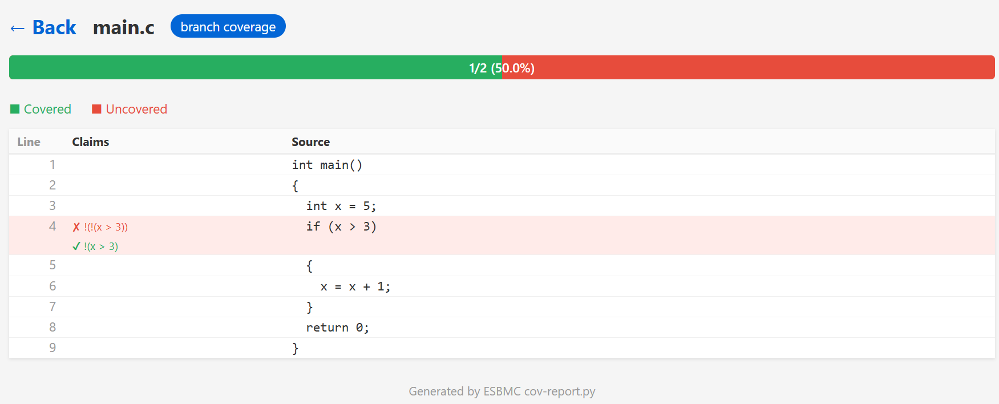

ESBMC supports coverage analysis for branch, condition, assertion, and k-path coverage. This helps identify which code paths have been tested in your program.

## Usage

ESBMC provides four coverage analysis modes:

```bash
# Branch coverage
esbmc example.c --branch-coverage

# Condition coverage
esbmc example.c --condition-coverage

# Assertion coverage
esbmc example.c --assertion-coverage

# K-path coverage (PathCrawler-style bounded path coverage)
esbmc example.c --k-path-coverage
```

## Coverage Modes

### Branch Coverage

Branch coverage verifies that all branches of conditional statements are executed. For each `if`, `else`, `while`, or `for` statement, both the true and false branches must be covered.

**Example:**

```c
int check_sign(int n) {
    if (n > 0)
        return 1;
    else
        return -1;
}

int main() {
    check_sign(5);   // Only covers true branch
    return 0;
}
```

```bash
$ esbmc example.c --branch-coverage
...
[Coverage]
Branches : 2
Reached : 1
Branch Coverage: 50%

```

The **Branch Coverage: 50%** shows incomplete coverage. The output indicates that `n <= 0` is needed to cover the else branch.

**Full coverage example:**

```c
int main() {
    check_sign(5);    // Covers true branch
    check_sign(-3);   // Covers false branch
    return 0;
}
```

```bash
$ esbmc example.c --branch-coverage
...
[Coverage]
Branches : 2
Reached : 2
Branch Coverage: 100%
```

The **Branch Coverage: 100%** indicates all branches have been tested.

### Condition Coverage

Condition coverage verifies that each boolean sub-expression in conditional statements evaluates to both true and false at least once. Unlike branch coverage, which tests branches, condition coverage tests individual conditions within complex expressions.

**Example:**

```c
int validate(int x, int y) {
    if (x > 0 && y > 0)  // Complex condition
        return 1;
    else
        return 0;
}

int main() {
    validate(5, 3);   
    return 0;
}
```

```bash
$ esbmc example.c --condition-coverage
...
[Coverage]

Reached Conditions:  4
Short Circuited Conditions:  0
Total Conditions:  4

Condition Properties - SATISFIED:  2
Condition Properties - UNSATISFIED:  2

Condition Coverage: 50%
```

The **Condition Coverage: 50%** shows that only the true cases of both conditions were tested. For full condition coverage, each condition must evaluate to both true and false at least once:
- `x > 0` must be true (✓ tested) and false (✗ not tested)
- `y > 0` must be true (✓ tested) and false (✗ not tested)

**Full coverage example:**

```c
int main() {
    validate(5, 3);    // x>0: T, y>0: T
    validate(5, -1);   // x>0: T, y>0: F
    validate(-1, -1);  // x>0: F (y>0 short-circuited)
    return 0;
}
```
Note: Due to short-circuit evaluation in `&&`, when `x>0` is false, `y>0` is never evaluated. To test `y>0` as both true and false, `x>0` must be true in those tests.

### Assertion Coverage

Assertion coverage verifies that all assertions in the code are reached and tested. This ensures that all validation checks are exercised.

**Example:**

```c
int process(int n) {
    if (n > 10) {
        assert(n < 100);  
        return n * 2;
    }
    else {
        assert(n < 10);   
        return n + 2;
    }
    return n;
}

int main() {
    process(5);    // Covers second assertion
    return 0;
}
```

```bash
$ esbmc example.c --assertion-coverage
...
[Coverage]
Total Asserts: 2
Total Assertion Instances: 2
Reached Assertion Instances: 1
Assertion Instances Coverage: 50%
```

**Full coverage example:**

```c
int main() {
    process(50);   // Covers first assertion
    process(5);    // Covers second assertion
    return 0;
}
```

```bash
$ esbmc example.c --assertion-coverage
...
[Coverage]
Total Asserts: 2
Total Assertion Instances: 2
Reached Assertion Instances: 2
Assertion Instances Coverage: 100%
```

### K-Path Coverage

K-path coverage is a PathCrawler-style bounded path-coverage criterion. At every conditional branch `if (g) goto L`, ESBMC emits a witness goal for each combination of the previous *(n−1)* prior branch directions and the current direction. Each goal is discharged by the same multi-property engine used for branch coverage: a SAT verdict marks the corresponding bounded path as reachable, and the coverage percentage is reached witnesses divided by total witnesses.

This sits between branch coverage (length-1 prefixes only) and full path enumeration (exponential in the number of branches). With `n = 2` the metric is equivalent to *boundary-interior* coverage; larger *n* exposes correlations that branch coverage alone cannot distinguish.

**Flags:**

| Flag | Meaning |
|---|---|
| `--k-path-coverage[=N]` | Enable k-path coverage with prefix length `N`. If `N` is omitted, defaults to `--unwind`, falling back to 4 |
| `--k-path-coverage-claims` | List each reached witness with its guard sequence and source location |
| `--k-path-witness-depth=D` | Post-simplification depth cap on witness guards (default 8); witnesses whose simplified guard exceeds `D` are dropped |
| `--k-path-max-goals=M` | Per-function goal cap (default 10000); on overflow ESBMC aborts with an actionable error rather than silently truncating |

**Example (loop body with one branch):**

```c
int main()
{
  int x;
  for (int i = 0; i < 3; i++)
  {
    if (x > 0)
      x = x - 1;
    else
      x = x + 1;
  }
  return x;
}
```

```bash
$ esbmc example.c --k-path-coverage=2 --unwind 4 --no-unwinding-assertions
...
[Coverage]
k-Path Witnesses : 6
Reached : 4
k-Path Coverage: 66.66666666666667%
```

The remaining unreached witnesses correspond to bounded paths where the loop guard becomes correlated with `x > 0` after one iteration — a relationship that `--branch-coverage` cannot expose, since each branch is reachable in isolation.

**Phase-1 limitations.** The current implementation walks the goto program linearly to collect prior branch guards, which over-approximates the prefix when branches join: witnesses may reference variables mutated between the branches they constrain, so a witness reported as unreached may simply be infeasible rather than indicative of missing test inputs. Witnesses whose post-simplification depth exceeds `--k-path-witness-depth` are dropped (no ghost-flag fallback yet), and infeasible witnesses count toward the denominator. A proper CFG analysis, ghost-flag fallback, and spanning-set scoring are tracked under issue [#4325](https://github.com/esbmc/esbmc/issues/4325) for follow-up phases.

**References.** The criterion follows Williams, Marre, Mouy, and Roger, *PathCrawler: Automatic Generation of Path Tests by Combining Static and Dynamic Analysis*, EDCC 2005 ([doi:10.1007/11408901_21](https://doi.org/10.1007/11408901_21)); is closely related to the test-specification language of Holzer, Schallhart, Tautschnig, and Veith, *FShell: Systematic Test Case Generation for Dynamic Analysis and Measurement*, CAV 2008 ([doi:10.1007/978-3-540-70545-1_20](https://doi.org/10.1007/978-3-540-70545-1_20)); and grounds the loop-unrolling parameterisation in Huang, Meyer, and Weber, *Loop Unrolling: Formal Definition and Application to Testing*, ICTSS 2025 ([doi:10.1007/978-3-032-05188-2_2](https://doi.org/10.1007/978-3-032-05188-2_2)).

## Supported Languages

Coverage analysis is supported for:

- **C** - All C features supported by ESBMC
- **C++** - All C++ features supported by ESBMC
- **Python** - Full Python frontend support
- **Solidity** - Full Solidity frontend support

## Interpreting Coverage Results

The key output of coverage analysis is the **coverage percentage** shown in the `[Coverage]` section. This indicates what portion of your code paths have been exercised.

### Coverage Statistics

ESBMC reports:
- **Total elements**: Number of branches/conditions/assertions in the code
- **Reached elements**: How many were covered by the test inputs
- **Coverage percentage**: (Reached / Total) × 100%

### Understanding the Output

Coverage analysis uses verification internally to determine reachability. You may see `VERIFICATION SUCCESSFUL` or `VERIFICATION FAILED` in the output, but these are intermediate messages during coverage computation, not indicators of program correctness.

**What matters:** The coverage percentage (e.g., "Branch Coverage: 75%")
**Less relevant:** VERIFICATION status (just shows coverage tool operation)

## Python Examples

### Branch Coverage

```python
def is_positive(n: int) -> int:
    if n > 0:
        return 1
    else:
        return 0

# Only covers positive branch
is_positive(10)
```

```bash
$ esbmc example.py --branch-coverage
...
[Coverage]
Branches : 2
Reached : 1
Branch Coverage: 50%
```

The **Branch Coverage: 50%** indicates incomplete coverage.

### Condition Coverage

```python
def check_range(x: int, y: int) -> int:
    if x > 0 and y > 0:
        return 1
    else:
        return 0

# Full condition coverage - accounting for short-circuit evaluation
check_range(5, 3)    # x>0: T, y>0: T
check_range(5, -1)   # x>0: T, y>0: F
check_range(-1, -1)  # x>0: F (y>0 short-circuited)
```

```bash
$ esbmc example.py --condition-coverage
...
[Coverage]

Reached Conditions:  4
Short Circuited Conditions:  0
Total Conditions:  4

Condition Properties - SATISFIED:  4
Condition Properties - UNSATISFIED:  0

Condition Coverage: 100%
```

The **Condition Coverage: 100%** indicates that each condition was tested with both true and false inputs.

### Assertion Coverage

```python
def validate_positive(n: int) -> int:
    assert n > 0, "n must be positive"
    return n * 2

validate_positive(5)
```

```bash
$ esbmc example.py --assertion-coverage
...
[Coverage]

Total Asserts: 1
Total Assertion Instances: 1
Reached Assertion Instances: 1
Assertion Instances Coverage: 100%
```

## Technical Notes

- Coverage analysis in ESBMC uses **symbolic execution** and **SMT solving**
- Unlike traditional testing tools, ESBMC **determines path reachability** and calculates exact coverage percentages
- All paths are explored **automatically** without manual test case writing
- Coverage analysis adds false assertions to test each branch/condition
- Verification time increases with code complexity

### Combining with Other Flags

Coverage analysis can be combined with other ESBMC options:

```bash
# With bounded model checking
esbmc example.c --branch-coverage --unwind 10

# With k-induction
esbmc example.c --branch-coverage --k-induction
```

## Multiple Input Files

ESBMC supports coverage computation for multiple input files. For example:

```bash
$ esbmc 1.c 2.c --branch-coverage
```

or:

```bash
$ esbmc 1.c --include-file 2.c --branch-coverage
```

The generated coverage report includes reached and unreached targets across all input files. Note that coverage is computed in aggregate rather than on a per-file basis.

## Handling Assertions in Coverage Computation

By default, for branch and condition coverage, ESBMC treats all assertions as true. This assumes that all assertions hold, thereby reducing verification overhead.

ESBMC also supports coverage computation while taking assertions into account via **`--cov-assume-asserts`**. In this mode, assertions are converted into assumptions to preserve path constraints. Consequently, if an assertion instance fails, the corresponding execution path is considered unreachable and is not explored further.

```bash
$ esbmc example.c --branch-coverage --cov-assume-asserts
```

## JSON Output and HTML Report

ESBMC supports exporting and formatting coverage summaries. First, use **`--cov-report-json`** to generate a JSON coverage report (`cov-report.json`). For example:

```bash
$ esbmc 1.c --include-file 2.c --branch-coverage --cov-report-json
```

Next, run the Python script located in the ESBMC **scripts** directory:

```bash
$ python3 scripts/cov-report.py cov-report.json -o .
```


<center>Figure: Example LCOV-style HTML coverage report generated by cov-report.py.</center>

This script reads the JSON file produced by `esbmc --cov-report-json` and generates an LCOV-style HTML report, including annotated source code and per-file coverage summaries.
